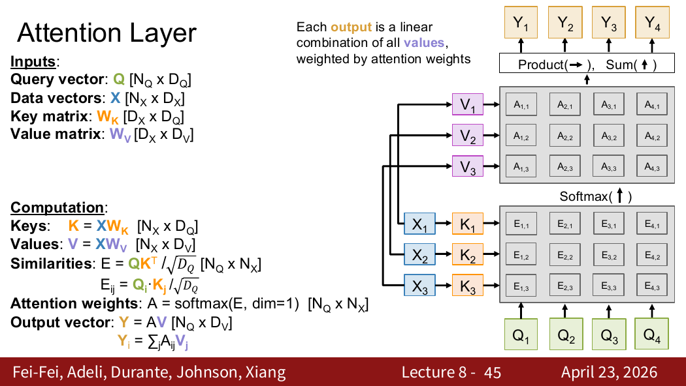
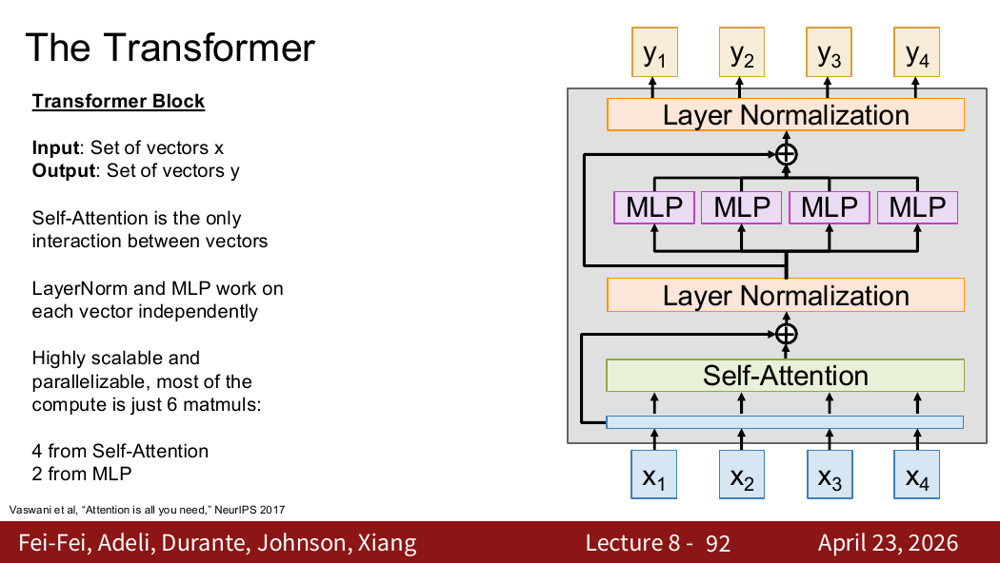
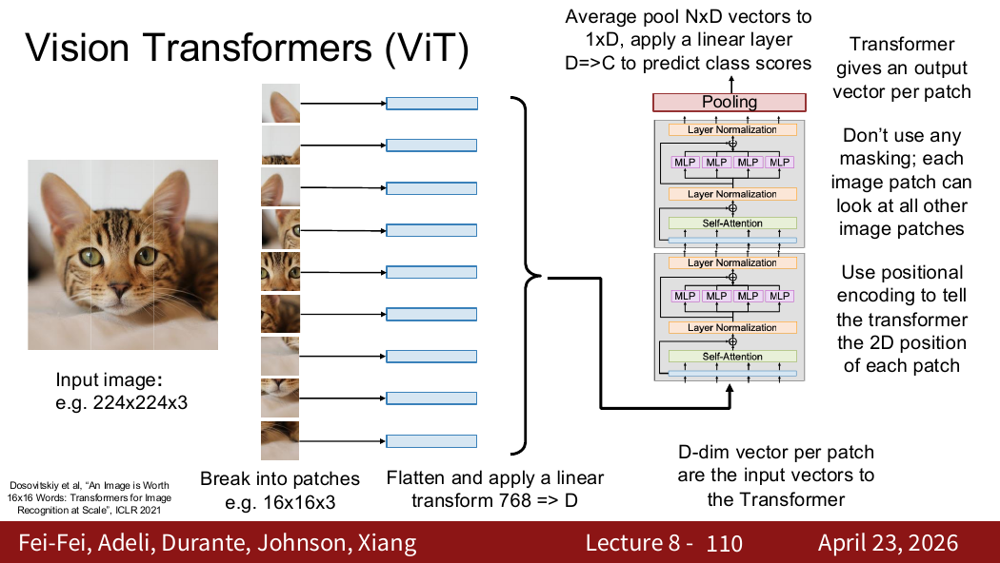

---
tags:
  - cs231n
  - 深度学习
  - Attention
  - Transformer
  - NLP
---

# Attention 与 Transformer

## 1. Attention 与 Transformer 的关系

**Attention** 是一种可以直接查看序列中其他词的机制，不需要对历史信息进行压缩（不需要像 RNN 那样依赖隐藏状态），可以描述为"作用在一组向量上的新计算单元"。**Transformer** 则是由大量 Attention 组合而成的网络结构。

## 2. RNN 的缺点（为什么需要 Attention）

| 缺点 | 说明 |
|------|------|
| **信息压缩** | 信息会不断被压缩进隐藏状态，远距离信息逐渐丢失（长程遗忘） |
| **长期依赖难** | 相隔很远的 token 之间难以建立有效联系 |
| **难以并行** | $h_t$ 在时间维度上逐级传递，必须串行计算 |

> Attention 的思路：**不是把历史信息压缩成单个向量，而是让每个位置在需要时直接 "查看" 序列中的其他位置，按重要程度加权汇总。**

## 3. Query、Key、Value

Transformer 每输入一个向量，都会产生三个新的向量：

| 向量 | 含义 | 通俗理解 |
|------|------|----------|
| **Query（查询）** | 明确"我"在寻找前文的什么 | 你在数据库里想搜什么？ |
| **Key（键）** | 提供匹配信息，用于被搜索 | 每条数据有什么标签可以匹配？ |
| **Value（值）** | 提供的具体内容 | 匹配成功后实际返回什么内容？ |

## 4. Attention 的计算流程

### 第一步：计算相关性（Query × Key）

利用查询和键计算相关性——这很直观：我要去查找（Query），对象提供用于匹配的标签（Key），两者做点积衡量匹配程度。

### 第二步：缩放（Scale）

当 $Q,K$ 各维分量方差相近时，点积的方差会随维度 $d_k$ 增长。过大的点积会使 Softmax 进入饱和区，梯度变小。因此除以 $\sqrt{d_k}$ 稳定其尺度：

$$
\text{Attention Score} = \frac{QK^T}{\sqrt{d_k}}
$$

### 第三步：Softmax 归一化

使用 Softmax 将相关性数值控制在合理范围，表示第 $i$ 个 token 对第 $j$ 个 token 的关注度和联系程度。

### 第四步：对 Value 加权求和

用 Softmax 得到的注意力权重对 Value 加权求和，得到最终输出：

$$
\text{Attention}(Q, K, V) = \text{softmax}\left(\frac{QK^T}{\sqrt{d_k}}\right) V
$$

## 5. Self-Attention（自注意力）

Self-Attention 表示 Query、Key、Value 都来自**同一个输入 $X$**。

$$
Q = XW_Q, \quad K = XW_K, \quad V = XW_V
$$

这使得每个位置都能根据自己的 Query，与所有位置的 Key 计算权重，再汇总相应的 Value。

### 相比 RNN 的优势

- **打破输入时间的束缚**：每个 token 可以直接关注任意位置的 token，不需要逐时间步传递。
- **实现了并行训练**：所有位置可以同时计算。

### 代价

注意力矩阵包含 $n^2$ 个位置对，因此标准自注意力的序列维计算与显存开销为 $O(n^2)$。序列长度翻倍时，这一部分的开销约变为四倍。

## 6. 位置编码（Positional Encoding）

Self-Attention 本身没有内置绝对或相对位置。若以相同方式重新排列所有输入 token，输出也只会相应重排；它无法仅凭计算知道某个 token 是“第几个位置”。

解决方法：不仅输入词向量，还要**加上位置向量**，将位置信息注入输入中。

## 7. Masked Self-Attention（因果掩码）

**因果掩码**的目的是：让模型在训练预测下一个 token 时，**不能提前看到后面和下一个的 token**。

做法：对第 $i$ 个 Query，把所有 $j>i$ 的未来位置分数设为 $-\infty$，Softmax 后这些位置的权重为 0。

## 8. Multi-head Attention（多头注意力）

多头注意力的核心思想：**同时关注多个不同的关系**。

- 用多组独立的 $W_Q, W_K, W_V$ 分别计算不同的注意力，捕捉不同类型的依赖关系（如语法关系、语义关系、位置关系等）。
- 最后将所有头的结果拼接起来。

## 9. Transformer Block

Transformer Block 由两个核心组件组成，同时配合 Layer Normalization 和残差连接：

| 组件 | 功能 |
|------|------|
| **Self-Attention** | 负责不同 token 之间的**交流**（token-to-token interaction） |
| **MLP / FFN** | 负责对**单个 token** 的非线性变换 |

### 辅助机制

| 机制 | 作用 |
|------|------|
| **残差连接** | 为梯度提供直接传播通道，缓解深层网络退化问题 |
| **Layer Normalization** | 对每个 token 的特征进行归一化，使数值更加稳定 |

## 10. Cross-Attention（交叉注意力）


Cross-Attention 与 Self-Attention 的核心区别在于 —— Self-Attention 的 Q、K、V 来自**同一个输入**，而 Cross-Attention 的 Q 来自一个序列（如 decoder），K 和 V 来自另一个序列（如 encoder 输出），用于两个不同序列之间的信息交互。

## 11. Vision Transformer（ViT）

Vision Transformer 的思路：

将图像先切成**多个小块（patch）**，每个 patch 视为一个 "token"，然后像处理文本一样输入 Transformer。

- 每个 patch 被展平为一个向量。
- 加上位置编码后，送入标准的 Transformer 处理。
- 打破了 CNN 依赖卷积归纳偏置的传统，用纯 Attention 处理图像。

若图像大小为 $H\times W$，patch 大小为 $P\times P$，则 token 数量为

$$
N=\frac HP\frac WP.
$$

每个 RGB patch 展平后维度为 $3P^2$，再线性投影到模型维度 $D$。通常还会加入分类 token 或对所有 patch 输出做平均池化。

## 12. 张量形状

设 $X\in\mathbb R^{N\times D}$，单头维度为 $d_k,d_v$：

$$
Q=XW_Q\in\mathbb R^{N\times d_k},
$$

$$
K=XW_K\in\mathbb R^{N\times d_k},
\qquad
V=XW_V\in\mathbb R^{N\times d_v}.
$$

于是

$$
QK^T\in\mathbb R^{N\times N},
\qquad
\operatorname{softmax}(QK^T/\sqrt{d_k})V
\in\mathbb R^{N\times d_v}.
$$

Softmax 通常沿 Key 维度进行，所以每个 Query 对所有 Key 的权重和为 1。

## 13. Transformer 编码器与解码器

- 编码器使用不带因果掩码的 Self-Attention；
- 自回归解码器使用 Masked Self-Attention；
- 编码器—解码器模型还使用 Cross-Attention，解码器状态提供 Query，编码器输出提供 Key 和 Value。

现代实现常采用 Pre-Norm：先做 LayerNorm，再进入 Attention 或 MLP，然后与残差分支相加。课件还提到 RMSNorm、SwiGLU 与 Mixture of Experts，它们是现代 Transformer 的常见变体。

## 14. 易错点

- Attention 是计算单元，Transformer 是由 Attention、MLP、残差和归一化等组成的架构。
- 注意力权重表示模型内部的加权关系，不自动等于因果解释。
- 无位置编码的 Self-Attention 对排列是等变的，而不是完全“什么都不变”。
- 因果掩码屏蔽的是未来位置 $j>i$。
- 标准自注意力的 $O(n^2)$ 代价来自所有 token 两两计算关系。

来源位置：Lecture 8 第 1–124 页。

## 15. PDF 知识点地图与补充图解

Lecture 8 的主线是：RNN 编码器—解码器瓶颈 → 单 Query Attention → Cross-Attention → Self-Attention → 位置编码与因果掩码 → 多头注意力 → Transformer Block → ViT → 现代变体。



来源：Lecture 8，第 45 张 PDF 页面。注意力输出不是“选择一个 token”，而是对全部 Value 的线性组合；Softmax 决定各 Value 的权重。



来源：Lecture 8，第 92 张 PDF 页面。只有 Self-Attention 在 token 之间交换信息；LayerNorm 和 MLP 分别作用于每个 token 的特征维。



来源：Lecture 8，第 110 张 PDF 页面。ViT 的关键数据流是：图像 → patch token → 位置编码 → 无因果掩码的 Transformer → 分类 token 或平均池化 → 类别分数。

### 补充：Attention 不是天然解释

注意力权重展示模型内部如何混合 Value，但权重高不一定意味着该输入在因果意义上最重要。模型还经过残差、MLP 和多层组合，因此解释模型时需要结合梯度、遮挡实验或其他方法。

---

## 总结：从 RNN → Attention → Transformer 的演进

```
RNN                   Attention               Transformer
信息压缩在隐藏状态      直接查看所有位置的加权汇总    大量 Attention 叠加
串行（慢）     →        并行（快）         →       并行 + 多层 + FFN
长程依赖难              突破距离限制                 位置编码 + 多头
```
