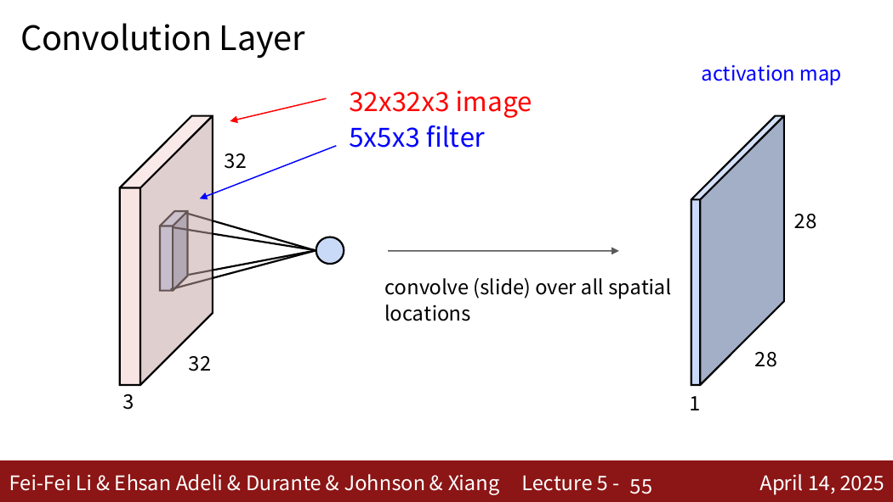
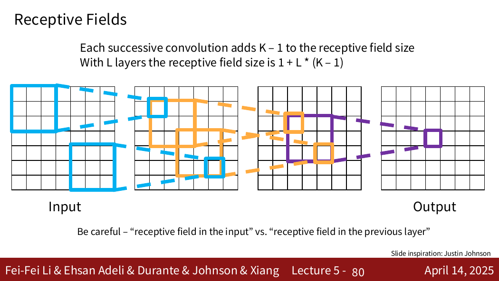
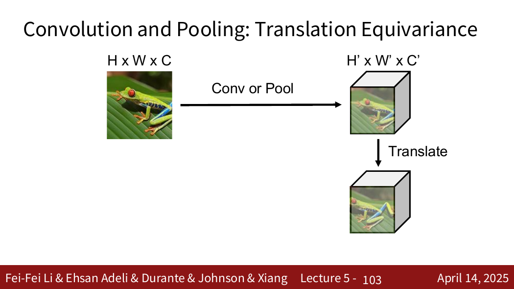

# CNN 卷积神经网络

> 对应：CS231n 2026 Lecture 5

## 1. 为什么图像适合卷积？

图像具有二维局部结构。全连接层将每个输出连接到所有输入像素，参数量大，也没有显式利用邻近像素更相关这一先验。卷积通过三个结构性约束处理图像：

- **局部连接**：每个输出只观察局部区域；
- **参数共享**：同一卷积核在所有空间位置重复使用；
- **多通道特征**：多个卷积核学习不同模式。

将图像展平不会在数值上“删除”空间信息，但会破坏网络结构对二维邻接关系的显式利用。

## 2. 卷积层的张量形状

采用 NCHW 格式：

| 对象 | 形状 |
|---|---|
| 输入 | $N\times C_{in}\times H\times W$ |
| 权重 | $C_{out}\times C_{in}\times K_h\times K_w$ |
| 偏置 | $C_{out}$ |
| 输出 | $N\times C_{out}\times H_{out}\times W_{out}$ |

卷积核必须覆盖输入的全部通道；卷积核的数量就是输出通道数。

严格说，深度学习库通常计算的是互相关，即不翻转卷积核，但习惯上仍称为卷积。

## 3. 输出空间尺寸

在 dilation 为 1 时：

$$
H_{out}=\left\lfloor\frac{H+2P-K_h}{S}\right\rfloor+1,
$$

$$
W_{out}=\left\lfloor\frac{W+2P-K_w}{S}\right\rfloor+1.
$$

- stride $S$：卷积核移动步长；
- padding $P$：输入边缘补零；
- 当 $K$ 为奇数、$S=1$、$P=(K-1)/2$ 时，空间尺寸保持不变。

## 4. 参数量与计算

卷积层参数量为

$$
C_{out}(C_{in}K_hK_w+1),
$$

其中 $+1$ 对应每个输出通道的偏置。参数量与输入图像的高宽无关，这是参数共享带来的优势。

## 5. 特征图与层次化表示

一个卷积核在所有位置检测同一种局部模式，产生一个特征图。多个核产生多个输出通道。

多层卷积逐步组合特征：

```text
边缘/颜色 → 纹理 → 部件 → 物体级语义
```

卷积输出大不一定只表示“模式相似”；实际响应还受到偏置、后续非线性和训练目标影响。

## 6. 平移等变性

理想情况下，输入平移会使卷积特征图相应平移，因此卷积具有平移等变性。边界填充、stride、pooling 等操作可能使这种性质不再严格成立。

等变不等于不变：

- 等变：输入移动，输出也移动；
- 不变：输入移动，最终输出基本不变。

## 7. 感受野

感受野表示某个特征位置能够受到多大输入区域影响。堆叠卷积、增大 stride 或使用 pooling 都会扩大感受野。

两个 stride 1 的 $3\times3$ 卷积具有 $5\times5$ 的有效感受野；相比一个 $5\times5$ 卷积，它通常参数更少，并增加一次非线性。

## 8. 池化

最大池化在窗口内取最大值，实现下采样：

- 前向：记录最大值及其位置；
- 反向：上游梯度只传给前向最大值的位置，其余位置为 0。

池化没有可学习参数，但会损失部分空间细节。现代架构也常用带 stride 的卷积完成下采样。

## 9. 一组形状示例

输入 $N\times3\times32\times32$，使用 10 个 $5\times5$ 卷积核、stride 1、padding 2：

$$
H_{out}=W_{out}=\frac{32+4-5}{1}+1=32.
$$

因此输出形状为

$$
N\times10\times32\times32.
$$

参数量为

$$
10(3\times5\times5+1)=760.
$$

## 10. 易错点

- 卷积核通道数等于输入通道数，卷积核个数等于输出通道数。
- 输出尺寸公式通常需要向下取整。
- 参数共享发生在空间位置之间，不是不同输出通道共用同一个核。
- pooling 会下采样，但没有学习怎样恢复信息。
- 平移等变不等于分类结果天然完全平移不变。

来源位置：Lecture 5 第 1–107 页。

## 11. PDF 知识点地图与补充图解

Lecture 5 的主线是：视觉表示历史 → 卷积的局部连接与参数共享 → 多核产生多通道 → stride/padding 与尺寸 → 感受野 → pooling → 平移等变性。



来源：Lecture 5，第 55 张 PDF 页面。一个卷积核覆盖全部输入通道，但只产生一个输出通道；若使用多个卷积核，就会得到多个输出通道。



来源：Lecture 5，第 80 张 PDF 页面。stride 1 时，每增加一层 $K\times K$ 卷积，感受野边长增加 $K-1$；存在 stride 时还需同时追踪相邻特征在原图中的间隔。



来源：Lecture 5，第 103 张 PDF 页面。理想卷积满足“先平移再卷积”等于“先卷积再平移”，但 padding、stride 和离散采样会造成边界或对齐差异。

### 补充：感受野递推

若第 $l$ 层的有效步距为 $j_l$、感受野为 $r_l$，卷积核大小和步幅分别为 $k_l,s_l$，则

$$
j_l=j_{l-1}s_l,
$$

$$
r_l=r_{l-1}+(k_l-1)j_{l-1}.
$$

这比只记“每层增加 $K-1$”更一般，因为它能够处理 stride 与 pooling。
