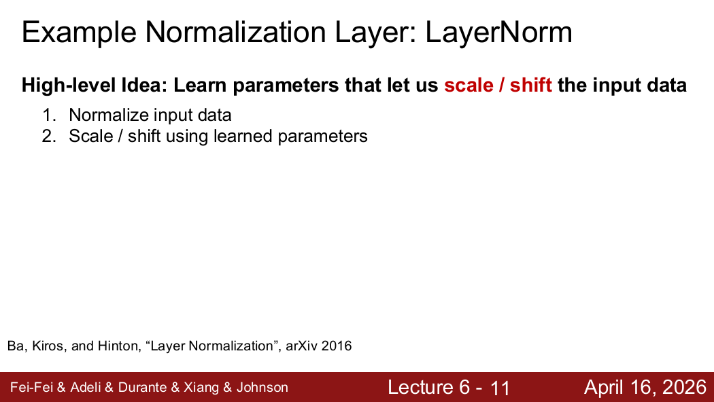
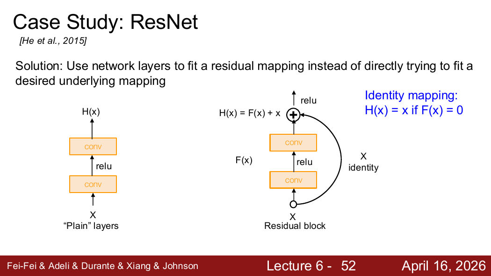
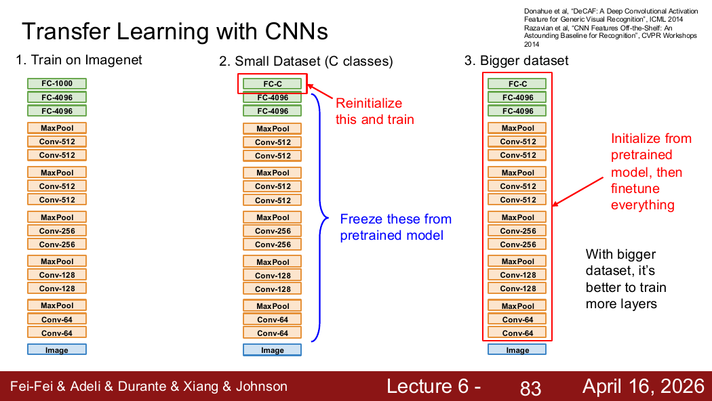

---
tags:
  - CNN
  - deep-learning
  - computer-vision
  - 笔记
---

# CNN 搭建与训练

## 1. 架构搭建要点

CNN 架构的搭建需要了解这些零件的连接顺序，每一层多少通道，何时缩小尺寸，网络的深度。

## 2. 归一化层（Normalization）

归一化层是为了解决数值相对关系相似时，数值尺度完全不一样的问题，数值尺度的优化以稳定训练效果。基本思路是最后化为均值为 0、方差为 1 的数值：

$$
\hat{x} = \frac{x - \mu}{\sqrt{\sigma^2 + \varepsilon}}, \quad y = \gamma \hat{x} + \beta
$$

- **$\gamma$**：重新调整尺度；
- **$\beta$**：重新调整位置。

因为强行规定每层输出都只能均值为 0、方差为 1，可能限制网络。加入 $\gamma, \beta$ 后，网络可以自己决定：这一层究竟应该保持标准化状态，还是重新放大、缩小或平移。

### Batch Normalization vs Layer Normalization

- **Batch** 是指一次用于更新的一组样本。**Batch Normalization（批归一化）**：训练时对一个 mini-batch 的激活统计均值与方差；在卷积特征中通常按通道统计，并跨 batch 与空间位置聚合。
- **Layer Normalization（层归一化）**：看同一个样本里面不同特征的分布。

两者的区别在于均值和方差沿着哪个方向计算：前者是**纵向**（同一个特征在不同样本中的分布），后者是**横向**（同一个样本中不同特征的分布）。

> 输入预处理和网络内部归一化发生的位置不同；“标准化/归一化”在不同教材中的用词并不完全统一，最好直接说明统计的维度与公式。

## 3. 激活函数（Activation Functions）

三种常见激活函数：

- **Sigmoid**
- **ReLU**
- **GELU**（不太了解）

## 4. 正则化：Dropout

Dropout 的作用是在训练时随机将部分激活置零，迫使网络不能过度依赖某些特征。

## 5. 经典 CNN 架构

### ImageNet 竞赛架构

AlexNet、VGG、ResNet 等是 ImageNet 竞赛中涌现的经典架构。

### VGG

VGG 的核心风格是：使用大量 $3 \times 3$、stride 1、padding 1 的卷积，并周期性使用 $2 \times 2$ 最大池化。好处是使用参数量小的卷积，可引入更多的激活函数，获得更强的非线性表达能力。

### ResNet 与残差连接

网络层数越深按理说会使得模型变得更好，但现实操作的难点是：
1. 怎样利用所有的网络避免出现恒等映射的情况；
2. 网络越深就越不好优化（不方便训练优化）。

**残差连接（ResNet）**的残差块表示为：

$$
H(x) = F(x) + x
$$

其中网络只需要学习残差函数 $F(x)=H(x)-x$，而不是直接学习完整映射 $H(x)$。这里的“残差”是相对于恒等映射需要增加的变换，不是预测值与标签之间的损失误差。

#### 残差连接更有利于梯度传播

设 $y = x + F(x)$，对 $x$ 求导：

$$
\frac{\partial y}{\partial x} = I + \frac{\partial F}{\partial x}
$$

反向传播：

$$
\frac{\partial L}{\partial x} = \frac{\partial L}{\partial y} \left( I + \frac{\partial F}{\partial x} \right)
$$

展开理解：

$$
\frac{\partial L}{\partial x} = \underbrace{\frac{\partial L}{\partial y}}_{\text{直接路径}} + \underbrace{\frac{\partial L}{\partial y} \frac{\partial F}{\partial x}}_{\text{经过卷积层的路径}}
$$

这里多出了一条直接路径 $\frac{\partial L}{\partial y}$，梯度不必完全穿过一连串卷积和激活函数才能到达前层。因此，**残差连接为信息和梯度提供了一条较直接的通道**。

## 6. 权重初始化

权重的初始化很重要：权重如果越小或者越大都会在激活过程中不断放大这种趋势。

### Kaiming 初始化

对于 ReLU 网络，一个常用初始化尺度是：

$$
W_{ij} \sim \mathcal{N}\left(0, \frac{2}{D_{\text{in}}}\right)
$$

标准差：

$$
\operatorname{std}(W) = \sqrt{\frac{2}{D_{\text{in}}}}
$$

这里 $D_{\text{in}}$ 是输入神经元数量，也称 `fan_in`。

**直觉**：层输入越多，每一个权重就应当适当缩小，从而让不同层中的激活方差保持在相对合理的范围。

## 7. 训练技巧

### 数据增强

数据增强是对图像做随机的不改变标签的变换，迫使模型学习那些变换不应该影响类别的变换。

### 迁移学习

迁移学习可以理解为可以直接搬已经训练好的大模型的网络的特定几个层（这几个层对应的是特定的特征），而这个又是小模型需要的，不需要重新训练。

### 冻结与微调

- **固定特征（Freeze）**：冻结预训练 backbone（通常是前面的卷积/Transformer 特征提取层），替换并训练新的分类头。适合数据较少且新任务与预训练任务相近的情况。
- **微调（Fine-tune）**：解冻部分或全部 backbone，通常以较小学习率继续训练；新分类头可以使用较大学习率。

## 8. 训练 CNN 时的排错流程

课程给出了一个很重要的调试流程：

1. 检查初始损失；
2. 尝试过拟合一个很小的数据子集；
3. 找到能够让损失明显下降的学习率；
4. 再使用完整训练集；
5. 最后逐渐加入正则化并调超参数。

## 9. 激活函数补充

| 激活函数 | 特点 | 主要问题/用途 |
|---|---|---|
| Sigmoid | 输出在 $(0,1)$ | 容易饱和，输出非零中心 |
| tanh | 输出在 $(-1,1)$ | 仍会饱和 |
| ReLU | $\max(0,x)$ | 简单高效，但可能出现长期不激活的单元 |
| GELU | 平滑地按输入大小进行门控 | Transformer 中常见 |

## 10. BatchNorm 的训练与推理

训练时 BatchNorm 使用当前 mini-batch 的统计量，并更新 running mean/variance；推理时使用训练期间累计的运行统计量。因此：

- batch 很小时统计可能不稳定；
- 忘记切换 train/eval 模式会造成结果异常；
- LayerNorm 不依赖其他样本，更适合序列模型和小 batch 场景。

## 11. 经典架构的演进

- **AlexNet**：推动深度 CNN 在 ImageNet 上取得突破；
- **VGG**：规则地堆叠 $3\times3$ 卷积，结构直观但计算和参数量较大；
- **GoogLeNet**：使用多分支 Inception 模块和全局平均池化；
- **ResNet**：利用残差连接训练更深网络。

深度增加只扩大表示能力，不保证训练误差或测试性能自动改善；优化、归一化、数据和正则化同样重要。

## 12. Dropout 的训练与推理

训练时随机丢弃激活，并通常采用 inverted dropout 对保留激活除以保留概率，使期望尺度保持一致；推理时关闭随机丢弃。Dropout 是正则化方法，不是归一化方法。

## 13. 易错点

- BatchNorm 与 LayerNorm 的区别取决于统计维度，不能只记“纵向/横向”。
- 残差 $F(x)$ 不是监督学习中的预测误差。
- 冻结的通常是预训练 backbone，而不是“前面的全连接层”。
- Dropout、BatchNorm 在训练和推理阶段的行为不同。
- 迁移学习应根据数据量和任务相似度决定冻结或微调范围。

来源位置：Lecture 6 第 1–98 页。

## 14. PDF 知识点地图与补充图解

Lecture 6 可分成两组：

- **网络零件与稳定训练**：归一化、激活函数、权重初始化、数据增强；
- **架构与迁移**：AlexNet/VGG/GoogLeNet/ResNet、残差连接、迁移学习。

来源：Lecture 6，第 11 张 PDF 页面。所有归一化层都需要问清楚：对哪些维度计算均值和方差？可学习的 $\gamma,\beta$ 应用在哪些维度？训练与推理是否使用相同统计量？

来源：Lecture 6，第 52 张 PDF 页面。残差块学习 $F(x)$，最终输出 $H(x)=F(x)+x$。当 $F(x)=0$ 时，网络可以轻易实现恒等映射。

来源：Lecture 6，第 83 张 PDF 页面。数据越少、任务越相似，越适合冻结更多 backbone；数据越多或任务差异越大，越有理由微调更多层。

### 补充：训练前的三项基准检查

1. 随机初始化且无正则化时，$C$ 类 Softmax 的初始损失应接近 $\log C$；
2. 在极小数据子集上应能把训练误差降得很低，否则先检查实现；
3. 同时观察训练与验证曲线，区分欠拟合、过拟合和优化失败。
