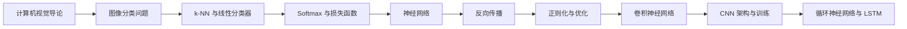

<div align="center">

# CS231n 中文学习笔记

### Deep Learning for Computer Vision

从图像分类与线性模型出发，逐步理解神经网络、反向传播、优化方法、卷积神经网络和序列建模。

[](https://cs231n.stanford.edu/)
[](#笔记目录)
[](https://www.markdownguide.org/)
[](#学习进度)

[开始阅读](#笔记目录) · [学习路线](#学习路线) · [课程资源](#参考资料)

</div>

---

## 关于本仓库

本仓库记录我学习 Stanford **CS231n: Deep Learning for Computer Vision** 时对核心知识的理解与归纳，重点梳理公式背后的直觉、不同方法之间的联系，以及训练神经网络时常见的实践问题。

笔记采用中文编写，适合以下场景：

- 第一次接触计算机视觉和深度学习；
- 学完课程后快速复习核心概念；
- 面试前回顾分类模型、反向传播、优化器和 CNN；
- 使用 Obsidian 或其他 Markdown 编辑器建立自己的知识体系。

> [!NOTE]
> 这是个人学习笔记，不是 Stanford 官方中文讲义。内容会随着学习进度持续修订。

## 学习路线



这条路线从“图像如何被计算机表示”开始，先建立分类问题的基本框架，再逐步进入可学习模型、梯度优化、深度卷积网络与序列建模。

## 笔记目录

| # | 主题 | 核心内容 | 状态 |
| :---: | --- | --- | :---: |
| 01 | [计算机视觉导论](导论.md) | 视觉发展史、任务层次、自监督学习 | ✅ |
| 02 | [线性分类器与视觉分类](线性分类器进行视觉分类.md) | 图像分类、k-NN、超参数、线性分类器 | ✅ |
| 03 | [神经网络与反向传播](神经网络和反向传播.md) | Softmax、激活函数、计算图、链式法则 | ✅ |
| 04 | [正则化与优化](正则化与优化.md) | L1/L2、SGD、Momentum、RMSProp、Adam | ✅ |
| 05 | [CNN 卷积神经网络](CNN卷积神经网络.md) | 卷积、步幅、填充、池化、感受野 | ✅ |
| 06 | [CNN 搭建与训练](CNN搭建与训练.md) | 归一化、Dropout、ResNet、初始化、训练技巧 | ✅ |
| 07 | [循环神经网络 RNN](循环神经网络RNN.md) | Vanilla RNN、Embedding、BPTT、梯度裁剪、LSTM | ✅ |

## 核心知识框架

<details>
<summary><strong>1. 从像素到分类结果</strong></summary>

图像在计算机中表现为数值张量。分类模型需要学习一个从高维像素空间到类别分数的映射，并通过损失函数衡量预测结果与真实标签之间的差异。

</details>

<details>
<summary><strong>2. 从线性模型到神经网络</strong></summary>

线性分类器通过一次仿射变换得到类别分数；神经网络则叠加多层线性变换与非线性激活函数，从而表达更复杂的决策边界。

</details>

<details>
<summary><strong>3. 从损失函数到参数更新</strong></summary>

反向传播利用链式法则计算每个参数对损失的影响，优化器再根据梯度、历史动量和自适应学习率等信息更新参数。

</details>

<details>
<summary><strong>4. 从全连接网络到 CNN</strong></summary>

CNN 利用局部连接和参数共享处理图像的空间结构，并通过多层特征提取逐步学习边缘、纹理、局部形状和高级语义。

</details>

<details>
<summary><strong>5. 从固定输入到序列建模</strong></summary>

RNN 通过循环状态保存历史信息，并在不同时间步共享参数；BPTT 负责沿时间维度传播梯度，而 LSTM 通过门控机制缓解长期依赖中的梯度消失问题。

</details>

## 如何使用

### 在线阅读

直接点击[笔记目录](#笔记目录)中的主题即可在 GitHub 阅读。

### 克隆到本地

```bash
git clone https://github.com/schnitzlermandy85-beep/cs231n-notes.git
cd cs231n-notes
```

推荐使用 [Obsidian](https://obsidian.md/) 或 VS Code 打开仓库目录，以便搜索、建立双向链接和补充个人笔记。

## 仓库结构

```text
cs231n-notes/
├── README.md
├── 导论.md
├── 线性分类器进行视觉分类.md
├── 神经网络和反向传播.md
├── 正则化与优化.md
├── CNN卷积神经网络.md
├── CNN搭建与训练.md
└── 循环神经网络RNN.md
```

## 学习进度

### 已完成

- [x] 计算机视觉与图像分类基础
- [x] 线性分类器与 Softmax
- [x] 神经网络与反向传播
- [x] 正则化与常见优化器
- [x] CNN 原理、经典架构与训练方法
- [x] RNN、BPTT、梯度裁剪与 LSTM

### 待更新笔记

- [ ] 注意力机制与 Transformer
- [ ] Vision Transformer（ViT）
- [ ] 目标检测：R-CNN、Fast/Faster R-CNN 与 YOLO
- [ ] 图像分割：语义分割、实例分割与 Mask R-CNN
- [ ] 可视化与模型解释：特征图、显著性图与 Grad-CAM
- [ ] 生成模型：Autoencoder、VAE、GAN 与 Diffusion
- [ ] 自监督学习与对比学习
- [ ] 视频理解与时序建模
- [ ] 三维视觉与点云基础
- [ ] 多模态视觉与视觉语言模型

### 内容完善计划

- [ ] 为重点公式补充完整推导
- [ ] 增加网络结构与训练流程示意图
- [ ] 补充 PyTorch 实现示例
- [ ] 整理模型训练、调参与排错实验

## 参考资料

- [Stanford CS231n 课程主页](https://cs231n.stanford.edu/)
- [CS231n Course Notes](https://cs231n.github.io/)
- [CS231n Assignments](https://cs231n.github.io/assignments.html)
- [PyTorch Documentation](https://pytorch.org/docs/stable/index.html)

## 反馈与交流

如果你发现内容错误、公式问题或可以改进的表述，欢迎提交 Issue。也欢迎基于这些笔记整理自己的理解和实践记录。

## 免责声明

本仓库仅用于个人学习与知识交流，与 Stanford University 及 CS231n 课程团队无官方关联。课程名称、原始讲义及第三方材料的相关权利归其各自所有者所有。

---

<div align="center">

如果这些笔记对你有帮助，欢迎点一个 Star ⭐

**Keep learning. Keep building.**

</div>
