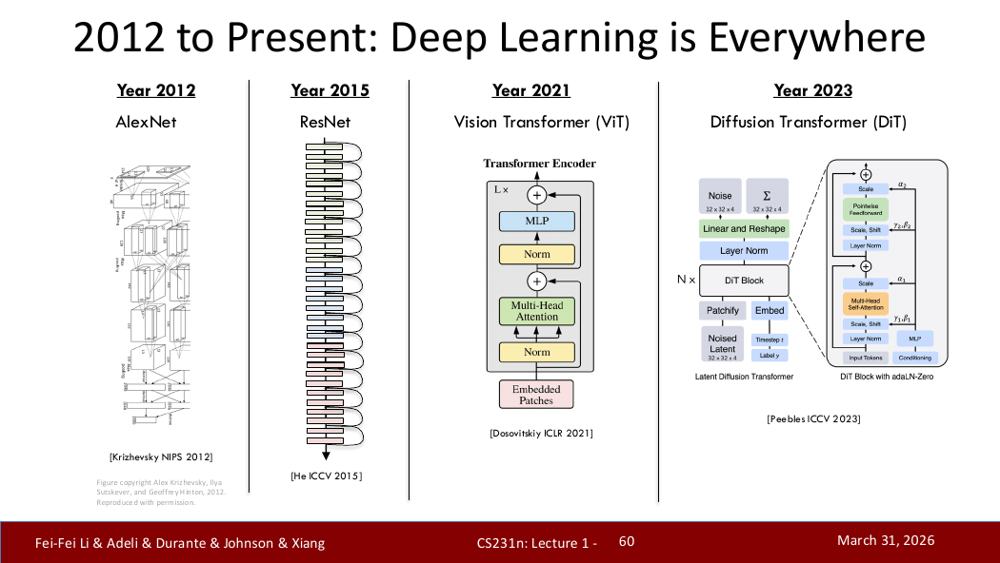
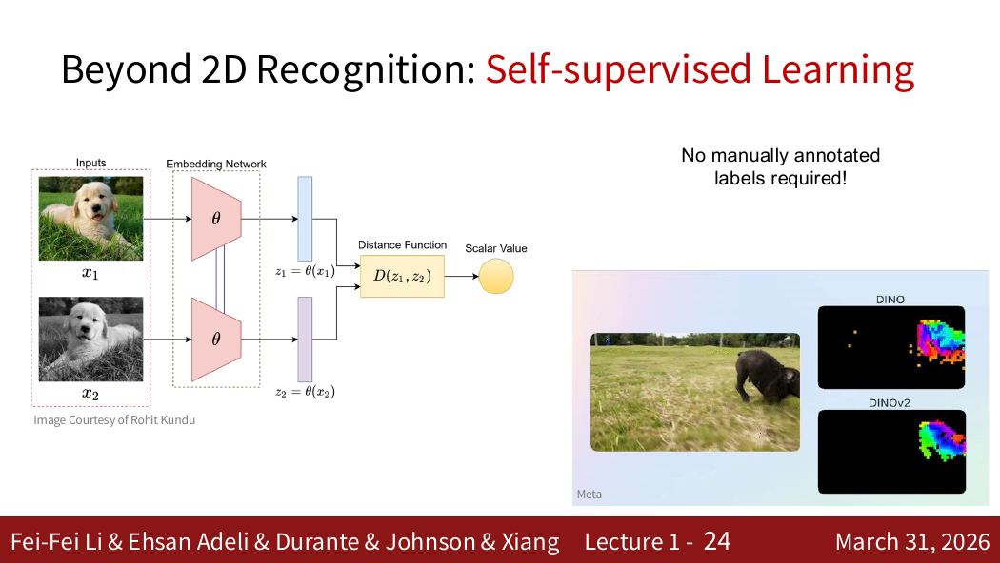

# 计算机视觉导论

> 对应：CS231n 2026 Lecture 1（Part 1–2）

## 1. 计算机视觉要解决什么？

计算机接收到的是像素数组，而人希望机器理解其中的物体、关系、动作和三维结构。计算机视觉的目标，是建立从低层像素到高层语义的映射。

视觉很难，因为同一类别会受到视角、尺度、姿态、光照、遮挡、背景和类内差异影响；不同图像的像素可能差异很大，但语义相同。

## 2. 发展主线

- **生物视觉启发**：Hubel 与 Wiesel 的研究表明，视觉皮层神经元会对特定方向和位置的刺激产生选择性反应，为层次化视觉处理提供了重要启发。
- **早期计算机视觉**：边缘、线条、几何部件和三维结构是重要研究对象。
- **特征工程时期**：研究者人工设计局部特征，再配合分类器进行识别。
- **数据集与深度学习时期**：更大的标注数据、GPU 和可端到端训练的深层网络推动了现代视觉的发展。

> 原笔记中的“1959 年研究清楚了视觉神经元”“1963 年一篇文章发表”过于笼统。更重要的是掌握主线：生物视觉启发 → 几何与人工特征 → 大规模数据与深度学习。

## 3. 从二维图像恢复三维信息

双目视觉可以利用同一物体在左右眼图像中的位置差异（视差）进行三角测量，从而估计深度。但三维视觉不只依赖双目：单目透视、遮挡、纹理、运动和学习到的先验也能提供深度线索。

因此，“二维到三维”不是简单地由两只眼睛一次解决，而是多种线索共同作用的结果。

## 4. 深度学习为什么适合视觉？

视觉表示具有层次性：

```text
像素 → 边缘/颜色 → 纹理 → 部件 → 物体 → 场景与关系
```

深层网络可以通过多层非线性变换逐级学习这些表示。反向传播负责高效计算参数梯度，优化器根据梯度更新参数；二者不是同一个过程。

## 5. 主要视觉任务

| 任务 | 核心问题 | 典型输出 |
|---|---|---|
| 图像分类 | 整张图是什么？ | 类别 |
| 语义分割 | 每个像素是什么类别？ | 像素类别图 |
| 目标检测 | 有哪些物体、在哪里？ | 类别与边界框 |
| 实例分割 | 每个实例占据哪些像素？ | 实例掩膜 |
| 视频理解 | 随时间发生了什么？ | 动作、事件或描述 |
| 三维视觉 | 场景的形状和空间关系是什么？ | 深度、点云、网格等 |
| 视觉与语言 | 图像怎样与文本语义对应？ | 描述、问答、跨模态表示 |

这些任务不是简单的“从低级到高级”单一路线，而是具有不同输出结构、监督信号与应用目标。

## 6. 监督学习与自监督学习

- **监督学习**使用人工标签，例如图像类别、框或分割掩膜。
- **自监督学习**从数据本身构造学习信号，不依赖每个样本的人工语义标签；模型先学习通用表示，再迁移到下游任务。

“自监督”不等于“没有训练目标”，而是训练目标由数据结构自动产生。

## 7. 数据、偏差与边界

模型学习的是训练数据中的统计规律，因此数据覆盖不足、标注偏差和分布变化都会影响模型。视觉系统不仅是网络结构问题，还涉及数据、评价指标、计算资源和社会影响。

## 8. 本课程路线


来源位置：Lecture 1 Part 1 第 1–81 页；Part 2 第 1–47 页。

## 9. PDF 知识点地图与补充图解

Lecture 1 可以沿四条线学习：

1. 视觉研究从生物启发、几何模型、人工特征走向深度学习；
2. 图像分类是基础任务，但课程还覆盖检测、分割、视频、三维和视觉语言；
3. 模型发展与数据集、算力和训练方法共同演进；
4. 现代视觉不只依赖人工标签，自监督学习会从数据本身构造训练信号。



来源：Lecture 1 Part 1，第 57 张 PDF 页面（页脚标为 Lecture 1-60）。图中应重点观察：CNN 并没有“消失”，而是视觉主干从经典卷积网络进一步发展到 Transformer 和生成模型。



来源：Lecture 1 Part 2，第 21 张 PDF 页面。自监督学习仍有明确训练目标，只是监督信号由图像、视频或多模态数据本身产生。
