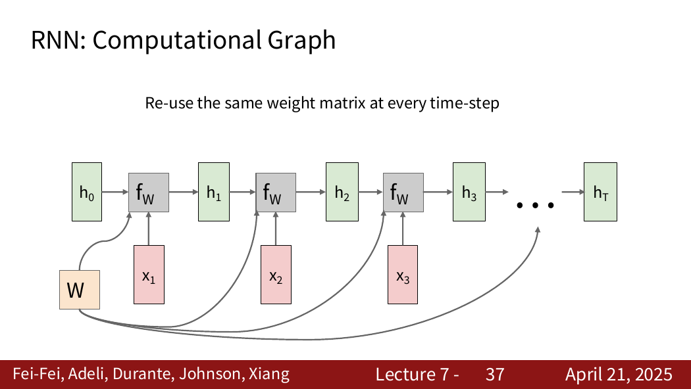
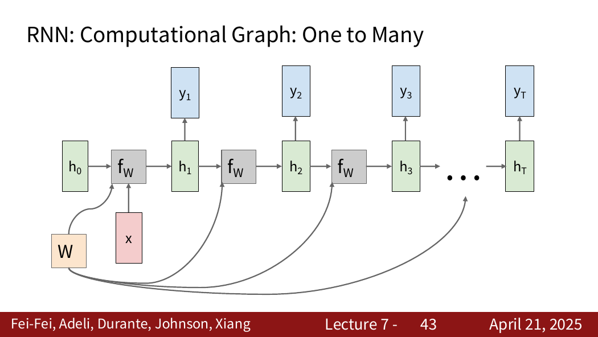
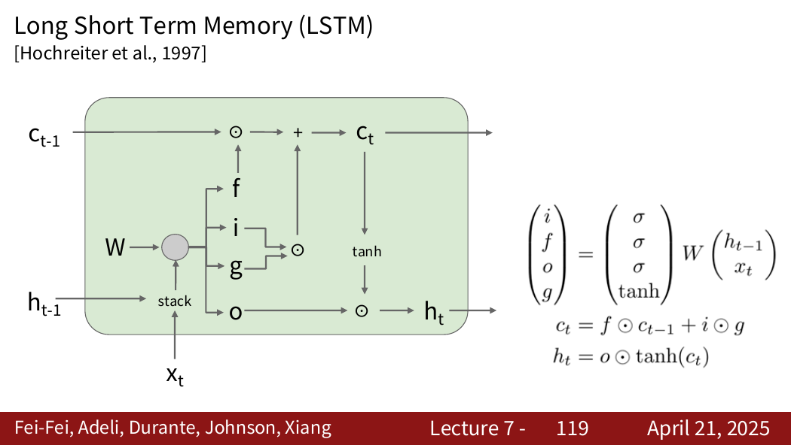

---
tags:
  - cs231n
  - 深度学习
  - RNN
  - LSTM
  - 序列模型
---

# 循环神经网络 RNN

## 1. RNN 概述

RNN 用于处理**序列数据**（一组有顺序的数据），如文本、语音、视频帧等。CNN 并非只能处理固定大小的图像；这里真正的区别是 RNN 显式维护随时间更新的状态，并在时间步之间共享参数。

> RNN 的核心思想：在读取第 $n$ 个输入时，不仅要看当前输入的值，还要看上一时刻的**隐藏状态**——这个状态可以理解成一个压缩的记忆量，让后续的节点能够知道比较整体的内容，结合上一个输入值，得到的反馈就更准确。

## 2. 为什么普通神经网络不适合序列

普通全连接层输入的长度必须是**固定的**（参数量固定），但序列数据的长度往往**不固定**。RNN 通过参数共享机制解决了这个问题。

## 3. 最基本的 Vanilla RNN

普通 RNN 的隐藏状态更新公式：

$$
h_t = \tanh \left( x_t W_{xh} + h_{t-1} W_{hh} + b_h \right)
$$

输出为：

$$
y_t = h_t W_{hy} + b_y
$$

其中：

| 符号 | 含义 |
|------|------|
| $x_t$ | 当前输入 |
| $h_{t-1}$ | 之前的记忆（上一时刻的隐藏状态） |
| $h_t$ | 更新后的记忆（当前隐藏状态） |
| $y_t$ | 当前输出 |
| $W_{xh}$ | 输入到隐藏状态的权重 |
| $W_{hh}$ | 旧隐藏状态到新隐藏状态的权重 |
| $W_{hy}$ | 隐藏状态到输出的权重 |

> $\tanh$ 是非线性激活函数，并且把隐藏状态限制在一定范围内（$[-1, 1]$）。

## 4. RNN 与多层神经网络的区别

这是一个关键的理解点：为什么 "展开 RNN" 的图看起来像多层网络，但本质完全不同？

| 对比维度 | 多层神经网络 | RNN |
|----------|------------|-----|
| **参数** | 每一层有**自己独立**的权重 $W^{(1)}, W^{(2)}, W^{(3)}...$ | **同一套参数** $(W_{xh}, W_{hh}, W_{hy})$ 在所有时间步**共享** |
| **输入** | 同一份输入 $x$ 逐层向前传递 | 每个时间步有**不同的新输入** $x_1, x_2, x_3...$ |
| **展开含义** | 展开的是**空间的深度**（不同层） | 展开的是**时间的长度**（同一套权重反复使用） |
| **信息流** | 单向：输入 → 层1 → 层2 → ... → 输出 | 循环：$h_{t}$ 既流向输出 $y_t$，又流向下一个 $h_{t+1}$ |

**直观理解**：

- **多层神经网络**像是流水线上的不同工位，每个工位有自己的一套工具（参数），原始材料（输入）经过每个工位逐步加工。
- **RNN** 像是同一个人在**逐字读一本书**：读完第 1 个字时，脑子里有了一个理解（$h_1$）；读第 2 个字时，这个理解结合新字一起更新（$h_2$）。读每个字用的是**同一套阅读能力**（同一组权重），但每次输入的字不同，记忆也在不断更新。

展开图的本质：把同一个人读每个字的瞬间**按时间顺序排开**，看起来像一排人，但实际上是同一个人的不同时刻。

## 5. 词嵌入（Embedding）

当词表很大时，直接将 token 转化为 one-hot 向量的办法不太好：
- 维度太高；
- 词语之间的相似性无法体现。

处理方法：使用 **Embedding 矩阵**，将高维稀疏向量映射为低维稠密向量，语义相近的词在嵌入空间中距离更近。

## 6. 时间反向传播（BPTT）

RNN 的反向传播使用**时间反向传播**（Backpropagation Through Time）。

### 前向计算图

```
h0 → h1 → h2 → h3
      ↓     ↓     ↓
      L1    L2    L3
```

### 反向传播

```
L3 → h3 → h2 → h1
L2 ─────→ h2 → h1
L1 ─────────→ h1
```

同一参数在所有时间步被重复使用，因此它的梯度要累加来自每个时间步的贡献。隐藏状态还通过递归连接形成很长的梯度传播路径，这正是长程依赖训练困难的来源。

## 7. 参数共享：CNN 与 RNN 对比

| 架构 | 共享方式 | 梯度累加方式 |
|------|---------|-------------|
| **CNN** | 同一个卷积核在不同**空间位置**共享 | 梯度跨空间位置累加 |
| **RNN** | 同一套 RNN 参数在不同**时间步**共享 | 梯度跨时间步累加 |

## 8. 梯度消失与梯度爆炸

### 梯度消失

从后往前算的时候会不断乘，乘以 $(-1, 1)$ 之间的数就会导致越来越趋近 0，早期时间步几乎收不到梯度。结果：一般的 RNN 很难学到相隔很远的信息（长程依赖问题）。

### 梯度爆炸

反过来，连续乘以大于 1 的数，梯度会变得特别大，导致训练不稳定、参数变化剧烈。

### 处理方法：梯度裁剪

确定一个阈值，超过阈值的梯度通过缩放使其落到合适范围内。

## 9. LSTM（长短期记忆网络）

### 核心思路

普通 RNN 把"记忆"全部塞在隐藏状态里，每一步都用非线性处理。LSTM 引入**细胞状态**（cell state）来专门承担长期记忆的传递。

| 概念 | 作用 |
|------|------|
| **细胞状态**（$c_t$） | 专门用于长期传递记忆的"高速公路"，信息可以几乎不变地穿越很多时间步 |
| **隐藏状态**（$h_t$） | 当前可以对外使用的状态，供输出和下一时刻使用 |

### 三个门控机制

| 门 | 作用 |
|----|------|
| **遗忘门** | 决定旧记忆保留多少 |
| **输入门** | 决定新的候选信息写入多少 |
| **输出门** | 细胞信息中有多少可以暴露到隐藏状态 |

### 记忆更新流程

1. **候选记忆**：当前可以写入细胞状态的新内容；
2. **细胞记忆更新**：由两部分组成——保留多少旧记忆 + 写入多少新记忆；
3. **隐藏状态输出**：通过输出门控制，从细胞状态中筛选对外暴露的信息。

### LSTM 的公式

令 (z_t=[h_{t-1},x_t])，则

$$
f_t=\sigma(W_fz_t+b_f),\qquad
i_t=\sigma(W_iz_t+b_i),
$$

$$
o_t=\sigma(W_oz_t+b_o),\qquad
g_t=\tanh(W_gz_t+b_g).
$$

细胞状态和隐藏状态更新为

$$
c_t=f_t\odot c_{t-1}+i_t\odot g_t,
$$

$$
h_t=o_t\odot\tanh(c_t).
$$

- $f_t$ 控制旧记忆保留多少；
- $i_t\odot g_t$ 控制写入多少新内容；
- $o_t$ 控制当前记忆暴露多少。

细胞状态中的加法路径使梯度不必在每一步都完全通过同一种饱和非线性，因此比 Vanilla RNN 更容易学习长程依赖，但不能保证彻底消除梯度问题。

## 10. 常见输入输出形式

| 形式 | 示例 |
|---|---|
| one-to-many | 图像描述生成 |
| many-to-one | 视频动作分类、情感分类 |
| many-to-many（对齐） | 每帧或每个 token 的标签 |
| many-to-many（不对齐） | 编码器—解码器序列转换 |

## 11. 图像描述中的 RNN

典型流程是先用 CNN 将图像编码为视觉特征，再由 RNN/LSTM 逐步生成单词。训练时通常使用真实的前一个 token 作为下一步输入；推理时则使用模型自己刚生成的 token，直到产生 `<END>`。

## 12. 易错点

- RNN 展开后的每个时间步共享同一套参数，不是不同网络层。
- 隐藏状态是学习到的向量表示，不是可直接解释的完整历史副本。
- BPTT 本质仍是计算图上的反向传播，只是计算图沿时间展开。
- 梯度裁剪主要缓解梯度爆炸，不能解决梯度消失。
- LSTM 的 $c_t$ 与 $h_t$ 作用不同。

来源位置：Lecture 7 第 1–119 页。

## 13. PDF 知识点地图与补充图解

Lecture 7 的主线是：序列任务类型 → Vanilla RNN 状态更新 → 时间展开与参数共享 → BPTT → 语言模型和图像描述 → 梯度消失/爆炸 → LSTM。



来源：Lecture 7，第 37 张 PDF 页面。横向展开表示同一个循环单元在不同时间的重复使用，不表示参数各自独立的多层网络。



来源：Lecture 7，第 43 张 PDF 页面。图像描述就是典型 one-to-many：图像特征初始化序列模型，之后逐步生成 token。



来源：Lecture 7，第 112 张 PDF 页面（页脚标为 Lecture 7-119）。图中上方的细胞状态通路通过“逐元素乘法 + 加法”更新，比 Vanilla RNN 每步都经过完整矩阵与 tanh 的路径更利于长程梯度传播。

### 补充：截断时间反向传播

长序列训练时，常只在固定长度窗口内展开计算图并反向传播，这称为 Truncated BPTT。它降低显存和计算成本，但也限制了梯度直接跨越很长时间距离。
