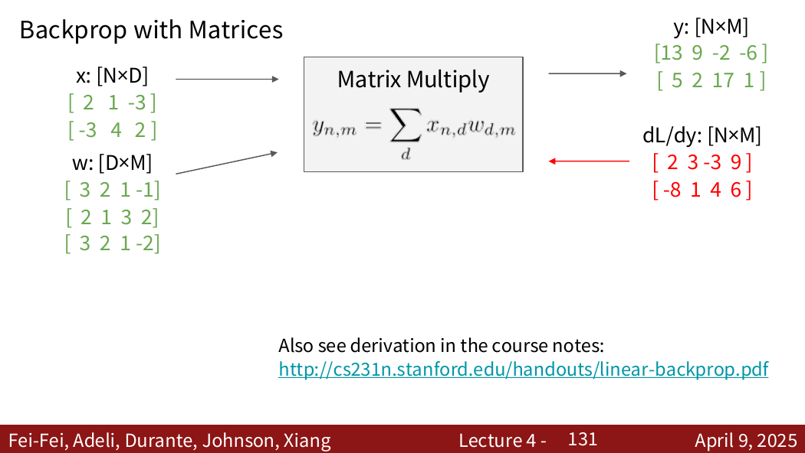

---
tags:
  - cs231n
  - 深度学习
  - 代码
  - numpy
  - 反向传播
---

# 必会代码：两层神经网络（NumPy 实现）

> 用纯 NumPy 实现一个带 ReLU 激活 + Softmax 交叉熵损失的两层全连接网络，包含前向传播、反向传播和完整的训练循环。

---

## 网络结构

```
输入 (D) → 全连接层1 (H) → ReLU → 全连接层2 (C) → Softmax
```

- **第一层**：`X @ W1 + b1`，从输入维度 `D` 映射到隐藏维度 `H`
- **激活函数**：ReLU（$\max(0, x)$）
- **第二层**：`h1 @ W2 + b2`，输出 `C` 个类别的分数
- **损失函数**：Softmax + 交叉熵 + L2 正则化

---

## 1. 类的初始化

```python
import numpy as np


class TwoLayerNet:
    def __init__(self, input_dim, hidden_dim, num_classes,
                 weight_scale=1e-2, reg=0.0):
        self.reg = reg
        self.params = {
            "W1": weight_scale * np.random.randn(input_dim, hidden_dim),
            "b1": np.zeros(hidden_dim),
            "W2": weight_scale * np.random.randn(hidden_dim, num_classes),
            "b2": np.zeros(num_classes),
        }
```

### 关键点

| 参数 | 初始化方式 | 原因 |
|------|-----------|------|
| `W1, W2` | 小标准差随机初始化 | 打破对称性，`weight_scale` 控制初始尺度防止激活值过大或过小 |
| `b1, b2` | 全零初始化 | 偏置不需要打破对称性 |

---

## 2. 损失函数（前向 + 反向）

### 2.1 前向传播

```python
    def loss(self, X, y=None):
        W1, b1 = self.params["W1"], self.params["b1"]
        W2, b2 = self.params["W2"], self.params["b2"]

        # ---------- forward ----------
        z1 = X @ W1 + b1              # (N, D) -> (N, H)
        h1 = np.maximum(0, z1)        # ReLU
        scores = h1 @ W2 + b2         # (N, H) -> (N, C)

        # 测试阶段只需要分类分数
        if y is None:
            return scores
```

#### 计算流程

| 步骤 | 操作 | 张量形状 |
|------|------|----------|
| 第一层线性 | `X @ W1 + b1` | `(N, H)` |
| ReLU 激活 | `np.maximum(0, z1)` | `(N, H)` |
| 第二层线性 | `h1 @ W2 + b2` | `(N, C)` |

> 设计要点：`y is None` 时只返回分数，不计算损失——训练和推理复用同一段代码。

### 2.2 Softmax + 交叉熵损失

```python
        # ---------- softmax loss ----------
        scores_shifted = scores - np.max(
            scores, axis=1, keepdims=True
        )

        exp_scores = np.exp(scores_shifted)
        probs = exp_scores / np.sum(
            exp_scores, axis=1, keepdims=True
        )

        N = X.shape[0]
        loss = -np.mean(np.log(probs[np.arange(N), y]))
```

#### Softmax 三步走

1. **数值稳定**：`scores - max`，防止 $\exp$ 溢出（$e^{1000} \to \infty$）
2. **求指数 + 归一化**：得到概率分布 $\text{probs}_{i,j} = \frac{e^{s_{i,j} - \max s_i}}{\sum_k e^{s_{i,k} - \max s_i}}$
3. **交叉熵**：取正确类别的负对数概率并求平均 $L = -\frac{1}{N}\sum_i \log(p_{i, y_i})$

### 2.3 L2 正则化

```python
        # L2 正则化
        loss += 0.5 * self.reg * (
            np.sum(W1 * W1) + np.sum(W2 * W2)
        )
```

正则化惩罚所有权重的平方和，乘以 `0.5 * reg` 使得求导后恰好是 `reg * W`（见反向传播）。

### 2.4 反向传播

```python
        # ---------- backward ----------
        dscores = probs.copy()
        dscores[np.arange(N), y] -= 1
        dscores /= N
```

#### Softmax + 交叉熵 的梯度

这是整个反向传播最关键的一步。Softmax + 交叉熵合并求导后，结果极其简洁：

> **正确类别**：$\frac{\partial L}{\partial s_{i, y_i}} = \frac{p_{i, y_i} - 1}{N}$
>
> **其他类别**：$\frac{\partial L}{\partial s_{i, j}} = \frac{p_{i, j}}{N}$

代码 `probs` 先复制，再对正确类别位置减 1，最后除 N，正对应上述公式。

#### 第二层（W2, b2）梯度

```python
        dW2 = h1.T @ dscores
        db2 = np.sum(dscores, axis=0)

        dh1 = dscores @ W2.T
```

| 梯度 | 计算方式 | 原理 |
|------|----------|------|
| `dW2` | `h1.T @ dscores` | 链式法则：$\frac{\partial L}{\partial W_2} = h_1^T \cdot \frac{\partial L}{\partial scores}$ |
| `db2` | `np.sum(dscores, axis=0)` | 偏置梯度沿 batch 维度求和（参数共享/多路径梯度相加） |
| `dh1` | `dscores @ W2.T` | 向上游传播梯度 |

#### ReLU 反向传播

```python
        # ReLU 反向传播
        dz1 = dh1 * (z1 > 0)
```

ReLU 的反向传播：**前向 > 0 的位置原样通过梯度，≤ 0 的位置截断为 0**。这里 `(z1 > 0)` 返回布尔矩阵，True → 1，False → 0。

#### 第一层（W1, b1）梯度

```python
        dW1 = X.T @ dz1
        db1 = np.sum(dz1, axis=0)
```

与第二层逻辑一致：`dW1 = X.T @ dz1`，`db1` 沿 batch 求和。

### 2.5 正则化梯度

```python
        # 正则化梯度
        dW2 += self.reg * W2
        dW1 += self.reg * W1

        grads = {
            "W1": dW1,
            "b1": db1,
            "W2": dW2,
            "b2": db2,
        }

        return loss, grads
```

> L2 正则化 $\frac{\lambda}{2}\|W\|^2$ 的梯度正好是 $\lambda W$，因此对 `dW` 加上 `reg * W`。

---

## 3. 训练循环

```python
# 一个最小训练循环
np.random.seed(0)

N, D, H, C = 64, 32, 100, 10
X = np.random.randn(N, D)
y = np.random.randint(C, size=N)

net = TwoLayerNet(
    input_dim=D,
    hidden_dim=H,
    num_classes=C,
    reg=1e-3
)

learning_rate = 1e-1

for step in range(1000):
    loss, grads = net.loss(X, y)

    for name in net.params:
        net.params[name] -= learning_rate * grads[name]

    if step % 100 == 0:
        print(f"step {step}, loss = {loss:.4f}")
```

### 训练流程

1. 生成随机数据 `(64, 32)` → 10 类标签
2. 初始化网络：`D=32, H=100, C=10, reg=1e-3`
3. 循环 1000 步：
   - 前向计算 loss
   - 反向计算 grad
   - **SGD 更新**：`param -= lr * grad`
4. 每 100 步打印 loss

---

## 4. 关键要点总结

| 要点 | 说明 |
|------|------|
| **参数初始化** | `W` 用小标准差随机初始化（打破对称），`b` 用零初始化 |
| **数值稳定** | Softmax 前减去最大值防止 $\exp$ 溢出 |
| **Softmax + CE 梯度** | 优雅简洁：`probs` 复制后正确类别位置减 1 |
| **ReLU 反向** | `dz = dh * (z > 0)` — 简单高效 |
| **正则化梯度** | `dW += reg * W`，与 L2 惩罚对应 |
| **偏置梯度** | 沿 batch 维度求和（参数共享原则） |
| **训练/推理复用** | `y is None` 时仅返回 scores，同一函数支持两阶段 |

---

## 5. 必做验证：形状检查

```python
loss, grads = net.loss(X, y)

assert np.ndim(loss) == 0
for name, param in net.params.items():
    assert grads[name].shape == param.shape, (
        name, grads[name].shape, param.shape
    )
```

反向传播中最常见的错误之一是矩阵转置或求和维度写错。梯度形状必须与对应参数完全一致。

## 6. 数值梯度检查

```python
def eval_numerical_gradient(net, X, y, name, index, h=1e-5):
    param = net.params[name]
    old = param[index]

    param[index] = old + h
    loss_pos, _ = net.loss(X, y)

    param[index] = old - h
    loss_neg, _ = net.loss(X, y)

    param[index] = old
    return (loss_pos - loss_neg) / (2 * h)


loss, grads = net.loss(X, y)
idx = (0, 0)
grad_num = eval_numerical_gradient(net, X, y, "W1", idx)
grad_ana = grads["W1"][idx]
relative_error = abs(grad_num - grad_ana) / max(
    1e-8, abs(grad_num) + abs(grad_ana)
)
print(relative_error)
```

数值梯度只用于少量参数的正确性检查，不能替代反向传播训练。

## 7. 从示例训练循环到真实训练

当前代码反复使用同一批随机数据，适合验证实现是否能降低损失，不代表完整训练流程。真实任务还应加入：

- 训练集/验证集划分；
- mini-batch 随机采样；
- 学习率调度；
- 准确率计算；
- 最优验证模型保存；
- 先过拟合一个很小子集的调试步骤。

### mini-batch 示例

```python
batch_size = 64
indices = np.random.choice(X_train.shape[0], batch_size)
X_batch = X_train[indices]
y_batch = y_train[indices]

loss, grads = net.loss(X_batch, y_batch)
for name in net.params:
    net.params[name] -= learning_rate * grads[name]
```

## 8. 数值稳定性补充

减去每行最大分数可以避免指数上溢，是 Softmax 的标准实现。极端情况下正确类别概率仍可能下溢为 0；更稳健的实现可以直接用 log-sum-exp 计算对数概率。

来源位置：Lecture 4、Section 2 Backprop，以及课程中两层网络的矩阵反向传播结构。

## 9. 对应课件图：矩阵反向传播



来源：Lecture 4，第 130 张 PDF 页面。代码中的

```python
dW2 = h1.T @ dscores
dh1 = dscores @ W2.T
```

分别对应 $dW=X^TG$ 与 $dX=GW^T$。写代码时最可靠的检查是：`dW.shape == W.shape`，`dX.shape == X.shape`。
