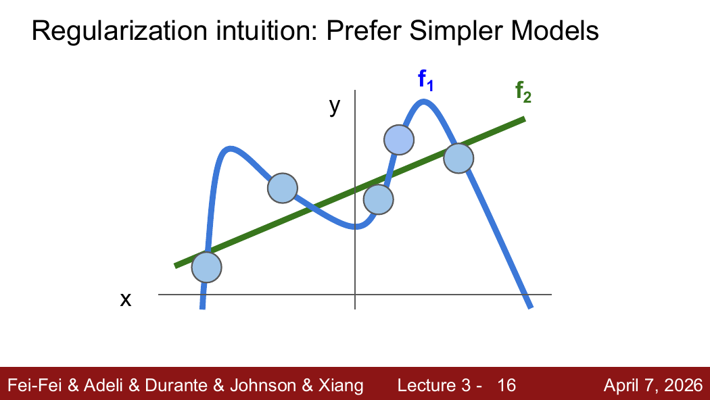
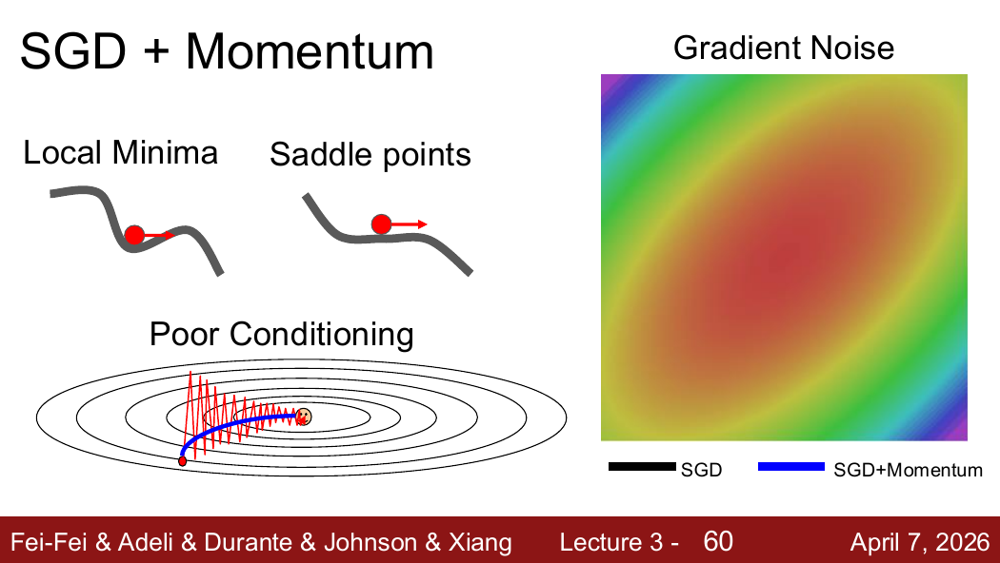
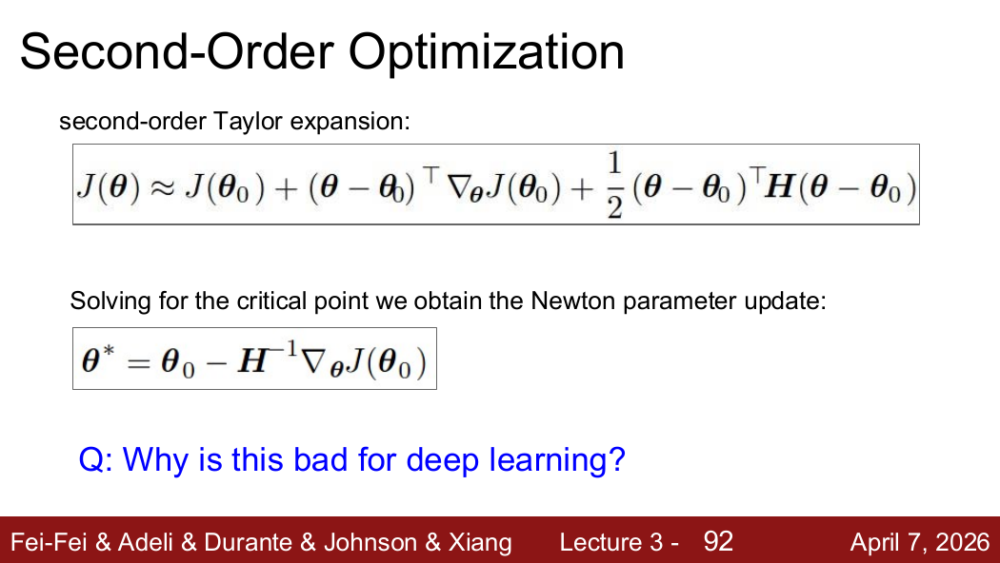

# 正则化与优化

> 对应：CS231n 2026 Lecture 3

## 1. 经验风险与正则化

训练目标通常写成

$$
L(W)=\frac{1}{N}\sum_{i=1}^{N}L_i(W)+\lambda R(W).
$$

- 第一项衡量模型对训练数据的拟合程度；
- $R(W)$ 限制模型复杂度；
- $\lambda$ 控制拟合训练数据与保持简单之间的权衡。

正则化的目标不是故意让训练集变差，而是在多个能够拟合训练数据的模型中偏好更可能泛化的模型。训练误差略升可能是代价，不是目的。

## 2. L1 与 L2 正则化

| 正则化 | 形式 | 主要效果 |
|---|---|---|
| L2 | $R(W)=\frac12\sum_j W_j^2$ | 倾向于使用许多较小的权重，平滑地惩罚大权重 |
| L1 | $R(W)=\sum_j\lvert W_j\rvert$ | 倾向于产生稀疏权重 |

L2 的梯度为 $W$，所以若系数为 $\lambda$，梯度中增加 $\lambda W$。正则化约束的是模型参数或行为，不是“让数据更加分散”。

## 3. 数值梯度与解析梯度

中心差分可以近似检查梯度：

$$
\frac{\partial L}{\partial W_j}
\approx
\frac{L(W_j+h)-L(W_j-h)}{2h}.
$$

- 数值梯度容易实现但很慢，主要用于梯度检查；
- 反向传播得到解析梯度，速度快，用于训练。

原笔记中的“H 型数值法”应为有限差分，常用的是中心差分。

## 4. 梯度下降与小批量 SGD

梯度 $\nabla L(W)$ 指向损失局部上升最快的方向，因此最小化损失时沿负梯度更新：

$$
W\leftarrow W-\eta\nabla L(W).
$$

小批量 SGD 每次用一批样本近似完整数据集梯度：

$$
g_t=\frac1B\sum_{i\in\mathcal B_t}\nabla_W L_i(W_t).
$$

这种估计含有噪声，但计算成本低，也能频繁更新。深度网络中的困难不应只概括为“卡在局部最小值”，鞍点、病态曲率和不同方向尺度差异同样重要。

## 5. Momentum

$$
v_t=\rho v_{t-1}+g_t,
\qquad
W_{t+1}=W_t-\eta v_t.
$$

动量会积累较稳定的下降方向，并减弱梯度在陡峭方向上的来回震荡。它不是保证跳出局部最优，而是改善优化轨迹。

## 6. RMSProp

$$
s_t=\beta s_{t-1}+(1-\beta)g_t^2,
$$

$$
W_{t+1}=W_t-\eta\frac{g_t}{\sqrt{s_t}+\varepsilon}.
$$

梯度长期较大的参数会得到较小的有效步长，不同参数因此具有自适应尺度。

## 7. Adam 与 AdamW

Adam 同时维护一阶矩和二阶矩：

$$
m_t=\beta_1m_{t-1}+(1-\beta_1)g_t,
\qquad
v_t=\beta_2v_{t-1}+(1-\beta_2)g_t^2.
$$

经过偏差修正后：

$$
W_{t+1}=W_t-\eta\frac{\hat m_t}{\sqrt{\hat v_t}+\varepsilon}.
$$

AdamW 将 weight decay 与 Adam 的梯度更新解耦。在现代深度网络中，它通常比把 L2 项直接混入自适应梯度更符合预期。

## 8. 学习率与训练判断

- 学习率过大：损失震荡或发散；
- 学习率过小：损失下降很慢；
- 训练后期通常使用学习率衰减；
- 优化器决定“如何利用梯度”，学习率决定更新的总体尺度。

常见策略包括阶梯衰减、余弦衰减和带 warmup 的调度。

## 9. 易错点

- 梯度指向上升最快方向，参数更新才沿负梯度。
- 数值梯度用于检查，反向传播得到的解析梯度用于训练。
- L1 倾向稀疏，L2 倾向较小且分散的权重。
- Momentum、RMSProp、Adam 都不能保证找到全局最优。
- 正则化、优化器和学习率分别解决不同问题。

来源位置：Lecture 3 第 1–121 页。

## 10. PDF 知识点地图与补充图解

Lecture 3 的主线是：用正则化表达模型偏好 → 用梯度寻找下降方向 → 识别 SGD 的困难 → 用 Momentum/RMSProp/Adam 改善更新 → 调整学习率 → 了解一阶与二阶方法的取舍。

来源：Lecture 3，第 16 张 PDF 页面。正则化不是要求模型“不要学会训练集”，而是防止把噪声也当作稳定规律。

### SGD 的四类困难

来源：Lecture 3，第 59 张 PDF 页面（页脚标为 Lecture 3-60）。

- **病态曲率**：不同方向变化速度差异很大，SGD 会之字形震荡；
- **鞍点/平坦区**：梯度很小但并非良好极小值；
- **mini-batch 噪声**：单批梯度只是真实梯度的估计；
- **局部结构复杂**：单步梯度只利用当前位置的一阶信息。

### 一阶与二阶优化

来源：Lecture 3，第 91 张 PDF 页面。二阶方法能利用曲率，但 Hessian 的存储和求逆对大规模神经网络代价过高，因此深度学习训练主要使用一阶方法及其变体。
