---
tags:
  - cs231n
  - 计算机视觉
  - 目标检测
  - 图像分割
  - 模型可视化
---

# 目标检测、图像分割与模型可视化

> CS231n 2026 Lecture 9：Detection, Segmentation, Visualization, and Understanding

## 1. 本讲知识框架

本讲把计算机视觉从"整张图是什么"扩展到三个更细的问题：

1. **语义分割**：每个像素属于什么类别？
2. **目标检测**：图中有哪些物体，它们在哪里？
3. **实例分割**：每个物体具体占据哪些像素？
4. **模型可视化**：模型依据图像中的哪些区域作出判断？

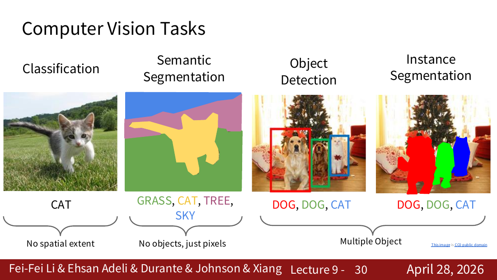

来源：CS231n 2026 Lecture 9，第 30 页。

| 任务 | 输出 | 是否区分同类个体 | 是否给出精确轮廓 |
|---|---|---:|---:|
| 图像分类 | 整张图的类别 | 否 | 否 |
| 语义分割 | 每个像素的类别 | 否 | 是，但只按类别区分 |
| 目标检测 | 每个物体的类别和矩形框 | 是 | 否 |
| 实例分割 | 每个物体的类别和像素掩膜 | 是 | 是 |

---

## 2. 课前回顾：ViT 与 Transformer 的常见改动

Lecture 9 前半部分简要回顾了 Vision Transformer（ViT）：

1. 把输入图像切成固定大小的 patch；
2. 将每个 patch 展平并线性投影成 $D$ 维向量；
3. 加入位置编码，使模型知道 patch 在图像中的位置；
4. 不使用因果掩码，让每个 patch 可以关注所有其他 patch；
5. 将向量序列送入 Transformer；
6. 使用分类 token，或者平均池化所有输出向量，再预测类别。

例如，$224 \times 224 \times 3$ 的图像使用 $16 \times 16$ 的 patch，会产生

$$
N=\frac{224}{16}\times\frac{224}{16}=196
$$

个图像 token。

课件还介绍了几种现代 Transformer 常见调整：Pre-Norm、RMSNorm、SwiGLU 和 Mixture of Experts。它们属于本讲回顾部分，不是检测与分割主线。

---

## 3. 语义分割（Semantic Segmentation）

### 3.1 问题定义

语义分割要为每个像素预测一个类别。若输入为

$$
X \in \mathbb{R}^{3 \times H \times W}
$$

模型输出通常为

$$
S \in \mathbb{R}^{C \times H \times W}
$$

其中 $3$ 是 RGB 通道数，$H, W$ 是图像尺寸，$C$ 是类别数。输出中每个空间位置都有 $C$ 个类别分数。

语义分割不区分同类物体的个体：两只猫的像素都会被标成"猫"，不会被区分为"猫 1"和"猫 2"。

### 3.2 为什么不能逐像素使用滑动窗口？

最直接的做法是以每个像素为中心截取 patch，用 CNN 判断中心像素的类别。必须观察 patch 而不是单个像素，是因为单个像素没有足够的上下文。

但相邻像素对应的 patch 高度重叠。如果每个 patch 都独立运行一次 CNN，相同区域会被重复计算，无法共享卷积特征，因此计算非常冗余。

### 3.3 全卷积网络（FCN）

FCN 的核心思想是：让整张图片一次通过网络，同时预测所有像素，而不是分别处理每个像素。

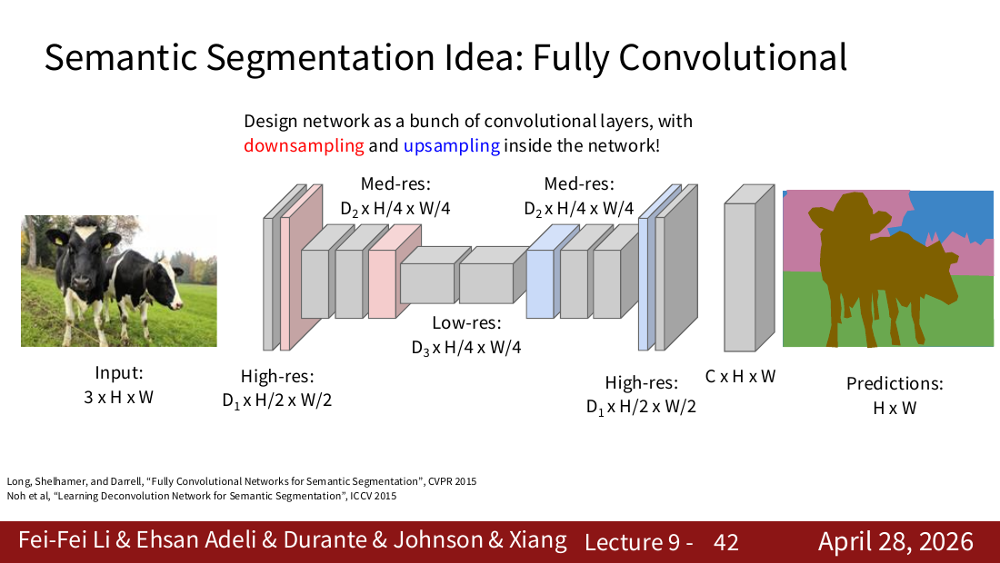

来源：CS231n 2026 Lecture 9，第 42 页。

网络分为两个阶段：

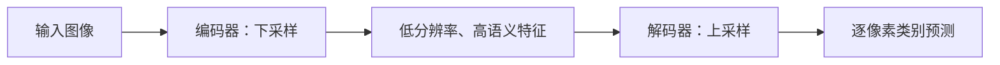

- **编码器（encoder）**不断下采样，扩大感受野，使网络理解"这是什么"；
- **解码器（decoder）**恢复空间分辨率，把理解投影回每个像素，确定"具体在哪里"。

只下采样是不够的：多个原始像素被压缩到少量特征位置后，虽然还能保留高级语义，却无法直接产生与原图同样精细的像素标签。

### 3.4 固定上采样

固定上采样没有可学习参数，常见方法包括：

- **最近邻上采样**：把每个值复制到周围位置；
- **钉床式（bed of nails）上采样**：把原值放到固定位置，其余位置补零；
- **Max Unpooling**：记录 Max Pooling 时最大值的位置，上采样时把值放回对应位置，其余位置补零。

这些方法都能增大空间尺寸，但放大规则由人工预先确定。

### 3.5 转置卷积：可学习的上采样

转置卷积中，每个输入值 $x$ 都会产生一个加权卷积核 $xK$。各输入位置产生的结果按照步幅放入输出，重叠位置相加。

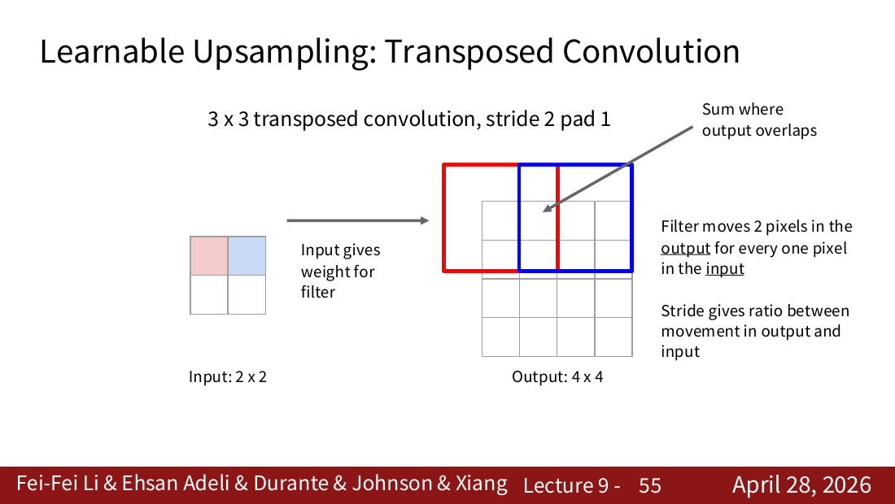

来源：CS231n 2026 Lecture 9，第 55 页。

一维例子：输入为 $[2,3]$，卷积核为 $[1,10,100]$，步幅为 $2$：

$$
[2,20,200,0,0]+[0,0,3,30,300]=[2,20,203,30,300]
$$

因此可用两个动作区分：

- 普通卷积从一块输入区域中**收集**信息，得到一个输出；
- 转置卷积把一个输入值的影响**散布**到多个输出位置。

卷积核 $K$ 可以通过训练学习，所以模型能够学习怎样上采样。需要注意：

- 转置卷积不是普通卷积的逆运算，不能凭空恢复已经丢失的信息；
- 它是否扩大特征图取决于卷积核大小、步幅、填充等参数；
- 用于上采样时通常设置步幅大于 $1$。

### 3.6 U-Net 与跳跃连接

仅靠低分辨率深层特征进行上采样，边界容易模糊。U-Net 把编码器中较高分辨率的特征直接传给解码器相同尺度的位置。

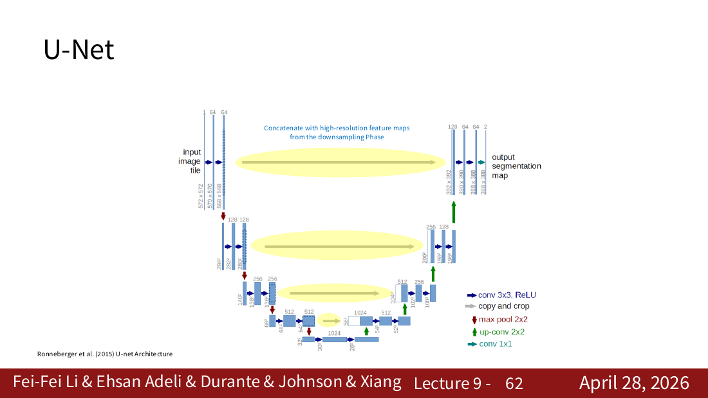

来源：CS231n 2026 Lecture 9，第 62 页。

跳跃连接通常进行通道拼接：

$$
F_{\text{combined}} = \operatorname{Concat}(F_{\text{decoder}}, F_{\text{encoder}})
$$

- 编码器浅层特征保存边缘、纹理和精确位置；
- 解码器深层特征保存类别与整体结构；
- 拼接后同时获得"这是什么"和"边界在哪里"。

---

## 4. 目标检测（Object Detection）

### 4.1 单物体：分类与定位

当图中只有一个物体时，可以让 CNN 共享特征，再分成两个输出头：

1. **分类头**：输出各类别分数，通常使用分类损失；
2. **边界框回归头**：输出四个连续数，通常使用回归损失。

边界框可以直接表示为 $(x, y, w, h)$：

- $x, y$：框中心的位置；
- $w, h$：框的宽和高。

总损失可以写成：

$$
L = L_{\text{cls}} + \lambda L_{\text{box}}
$$

这里的"回归"不是预测类别，而是预测连续数值。框的坐标通常会归一化，并且只对存在目标的样本计算框回归损失。

### 4.2 多目标为什么更难？

不同图像中的物体数量不同，因此模型输出不能简单设成固定数量的"类别 + 坐标"。早期思路是枚举大量不同位置、大小和长宽比的滑动窗口，再逐个分类，但计算量极大。

目标检测器主要有两类：

- **两阶段检测器**：先提出可能包含物体的区域，再分类并修正框；
- **单阶段检测器**：直接在密集位置上同时预测类别和边界框。

### 4.3 R-CNN：先找候选区域，再逐个分类

R-CNN 的步骤是：

1. 使用 Selective Search 生成约 2000 个候选区域；
2. 将每个候选区域裁剪并缩放到固定大小；
3. 每个区域分别通过 CNN；
4. 使用分类器判断类别；
5. 预测 $(d_x, d_y, d_w, d_h)$ 修正候选框。

其主要问题是：约 2000 个重叠区域各自执行一次 CNN，速度非常慢。

### 4.4 Fast R-CNN：先卷积，再裁剪特征

Fast R-CNN 对整张图只运行一次 backbone，得到共享特征图；随后在特征图上针对每个 RoI 裁剪并缩放特征，再分别进行分类与边界框回归。

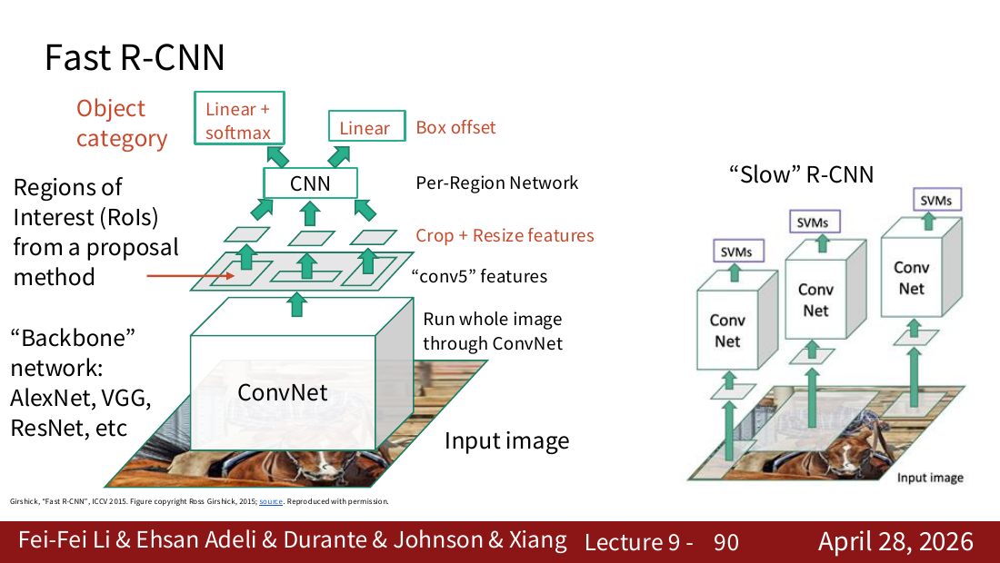

来源：CS231n 2026 Lecture 9，第 90 页。

关键改进是：

$$
\text{R-CNN：先裁图再分别卷积} \longrightarrow \text{Fast R-CNN：先共享卷积再裁特征}
$$

但 Fast R-CNN 的候选区域仍由外部算法生成，尚未实现端到端的候选框学习。

### 4.5 Faster R-CNN：加入 RPN

Faster R-CNN 使用 Region Proposal Network（RPN）从共享特征图中学习候选区域：

1. backbone 提取整张图的特征；
2. 在特征图每个位置放置 $K$ 个不同尺度和长宽比的 anchor；
3. 对每个 anchor 预测 objectness（是否包含物体）；
4. 对正 anchor 预测四个框变换量；
5. 选择得分较高的候选框，送入第二阶段分类与进一步回归。

四个框变换量表示相对于 anchor 的修正，而不是最终框的绝对坐标。常见形式为：

$$
d_x=\frac{x-x_a}{w_a}, \qquad d_y=\frac{y-y_a}{h_a}
$$

$$
d_w=\log\frac{w}{w_a}, \qquad d_h=\log\frac{h}{h_a}
$$

其中下标 $a$ 表示 anchor。$d_x, d_y$ 修正中心位置，$d_w, d_h$ 修正宽高比例。

### 4.6 单阶段检测器：YOLO、SSD、RetinaNet

单阶段检测器不先生成一批 RoI 再逐个处理，而是在密集网格位置上直接产生预测。

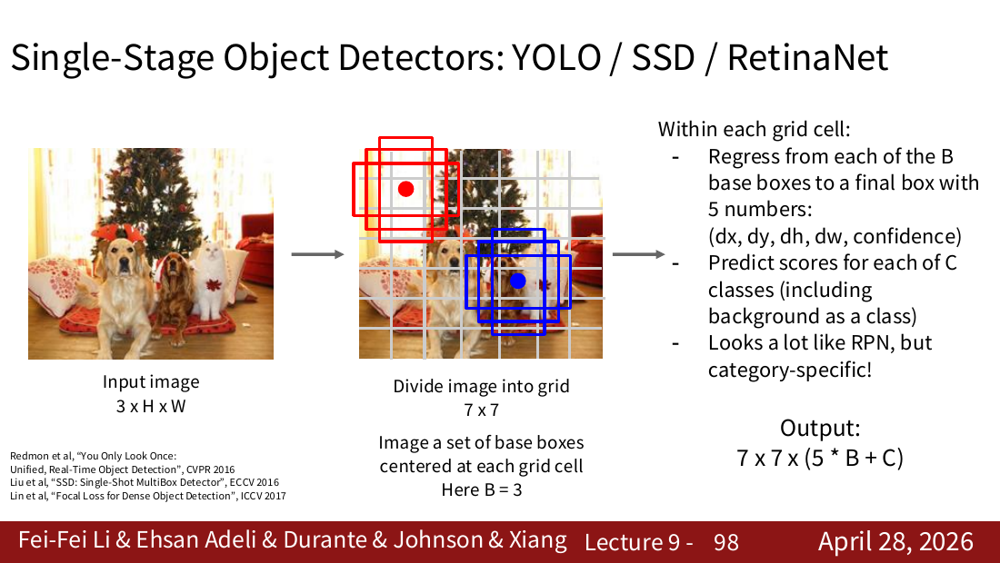

来源：CS231n 2026 Lecture 9，第 98 页。

课件中的概括是：每个网格位置设置 $B$ 个基础框，并预测：

- $(d_x, d_y, d_h, d_w)$：相对于基础框的位置和大小修正；
- confidence / objectness：框中是否包含目标；
- $C$ 个类别分数。

因此，一个 $S \times S$ 网格的典型输出形状为

$$
S \times S \times (5B + C)
$$

"YOLO = You Only Look Once"强调只需一次网络前向传播即可产生整张图的密集检测结果。实际预测常包含许多重叠框，推理阶段通常还需要按置信度筛选，并使用非极大值抑制（NMS）去除重复框。

> 补充理解：现代 YOLO 版本的具体输出形式可能与早期 YOLO 不完全相同，但"单次密集预测"的核心思想不变。

### 4.7 Two-stage 与 One-stage 的核心区别

| 两阶段检测器 | 单阶段检测器 |
|---|---|
| 先生成候选区域，再分类和精修 | 直接密集预测类别和框 |
| 代表：Faster R-CNN | 代表：YOLO、SSD、RetinaNet |
| 流程更复杂 | 流程更直接 |
| 通常更重视候选区域质量 | 通常更适合高效推理 |

两者都可以使用 anchor；"是否使用 anchor"并不是区分两阶段和单阶段的根本标准。

### 4.8 DETR：把检测看成集合预测

DETR 使用 CNN 提取图像特征，再用 Transformer encoder-decoder 直接输出固定数量的预测槽位。每个槽位输出一个类别和一个框；没有目标的槽位预测为 "no object"。

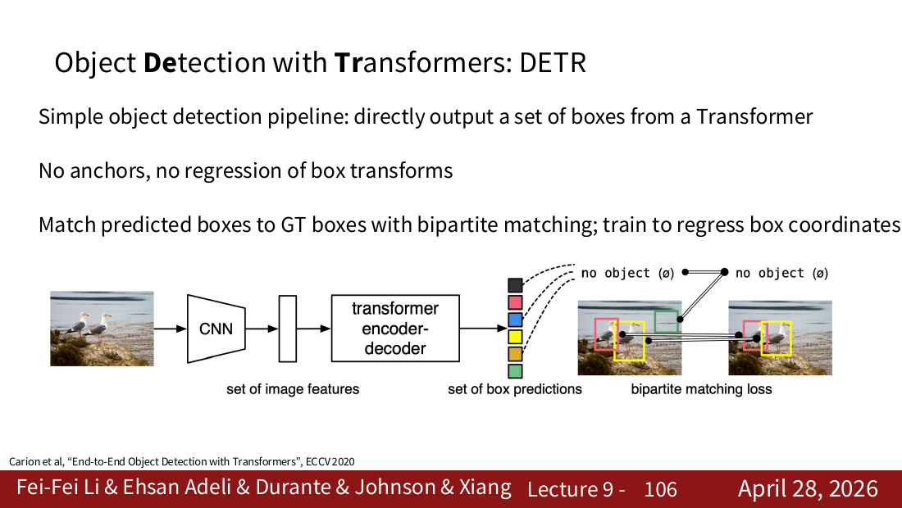

来源：CS231n 2026 Lecture 9，第 106 页。

DETR 的关键不是简单地"不要检测框"，而是：

- 不使用手工 anchor；
- 不回归相对于 anchor 的框变换；
- 直接预测一个无序的框集合；
- 使用二分图匹配，为每个真实框找到唯一的预测槽位，再计算训练损失。

这种一对一匹配减少了重复预测，因此原始 DETR 推理时不依赖传统 NMS。

---

## 5. 实例分割与 Mask R-CNN

目标检测只能给出矩形框，但真实物体通常不是矩形。实例分割既要区分不同物体，又要预测每个实例的像素轮廓。

Mask R-CNN 在 **Faster R-CNN** 的基础上增加 mask 分支，而不是在 Fast R-CNN 上简单附加输出：

1. CNN backbone 与 RPN 产生候选区域；
2. RoI Align 提取对齐的区域特征；
3. 分类分支预测物体类别；
4. 框回归分支预测边界框；
5. mask 分支为每个类别预测一个 $28 \times 28$ 的二值掩膜。

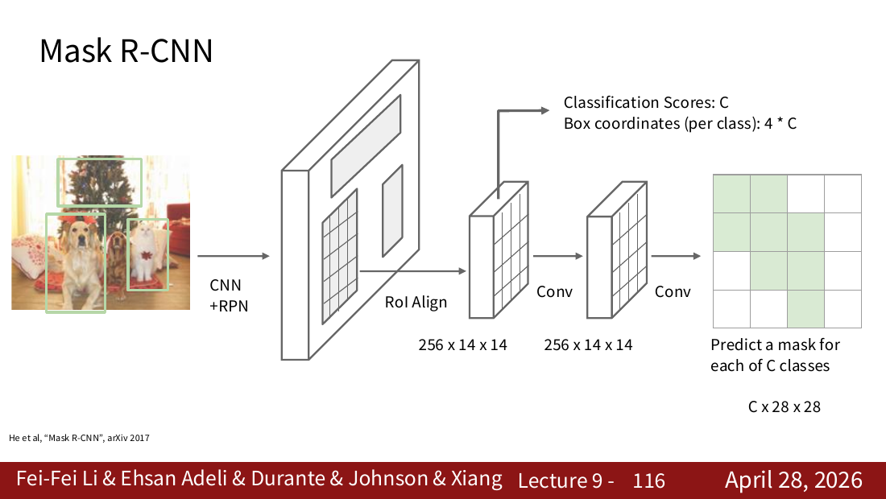

来源：CS231n 2026 Lecture 9，第 116 页。

mask 中的 $1$ 表示属于当前目标实例，$0$ 表示不属于该实例。最终只选取预测类别对应的那张 mask，并将其映射回原图中的 RoI。

RoI Align 的作用是避免粗糙取整造成的空间错位，这对于像素级边界预测尤其重要。

---

## 6. 模型可视化与理解

这一部分想回答：网络为什么预测某个类别？图像中的哪些区域影响了判断？

### 6.1 第一层卷积核

第一层卷积核直接处理 RGB 像素，因此可以直接可视化。训练后通常能看到：

- 不同方向的边缘检测器；
- 不同颜色组合；
- 简单纹理模式。

越深层的特征不再直接对应像素，解释会更困难。

### 6.2 Saliency Map：哪些输入像素最影响类别分数？

设类别 $c$ 的未归一化分数为 $S_c(I)$，对输入图像 $I$ 求梯度：

$$
G = \left|\frac{\partial S_c}{\partial I}\right|
$$

梯度绝对值较大的像素表示：如果轻微改变这些像素，类别分数可能改变得更多。将 RGB 通道合并后即可得到显著性图。

注意：显著性图反映的是模型输出对局部输入变化的敏感程度，不等于严格的因果解释。

### 6.3 CAM：用最后一层特征图定位判别区域

若最后一层卷积得到特征图 $f_k(x, y)$，随后使用全局平均池化和线性分类器，则类别 $c$ 的 CAM 可以写成：

$$
M_c(x, y) = \sum_k w_{k,c} f_k(x, y)
$$

其中 $w_{k,c}$ 是第 $k$ 个通道对类别 $c$ 的分类权重。CAM 可以显示哪些空间区域支持类别 $c$。

限制：经典 CAM 依赖"最后一层卷积 + 全局平均池化 + 线性分类器"的结构，而且通常只能用于最后一层卷积特征。

### 6.4 Grad-CAM：用梯度衡量通道的重要性

Grad-CAM 可以选择任意卷积层的激活

$$
A \in \mathbb{R}^{H \times W \times K}
$$

先计算类别分数 $S_c$ 对激活的梯度，再对空间位置求平均，得到每个通道对类别 $c$ 的权重：

$$
\alpha_k^c = \frac{1}{HW}\sum_i\sum_j \frac{\partial S_c}{\partial A_{ij}^{k}}
$$

最后对特征图加权求和并经过 ReLU：

$$
L_{\text{Grad-CAM}}^c = \operatorname{ReLU}\left(\sum_k \alpha_k^c A^k\right)
$$

ReLU 只保留对类别 $c$ 有正向支持的区域。

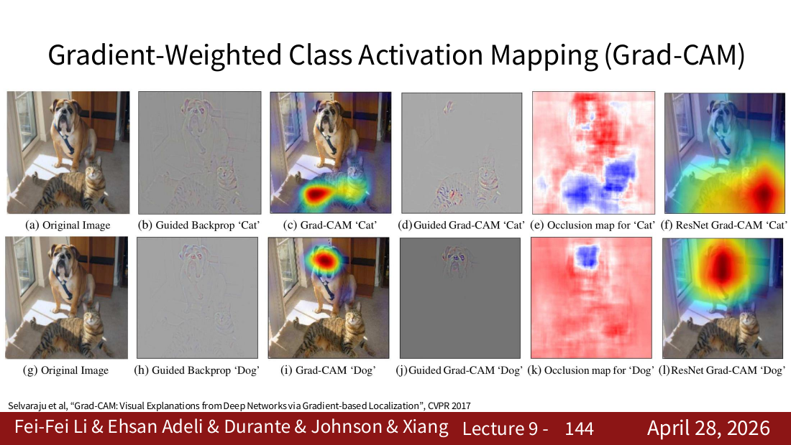

来源：CS231n 2026 Lecture 9，第 144 页。

图中同一张照片针对 "cat" 和 "dog" 得到不同热点，说明 Grad-CAM 是**类别相关**的解释。

### 6.5 三种方法的对比

| 方法 | 分析对象 | 优点 | 主要限制 |
|---|---|---|---|
| Saliency Map | 输入像素梯度 | 直接、细粒度 | 容易噪声较大，只反映局部敏感性 |
| CAM | 最后一层特征图与分类权重 | 直观、类别相关 | 对网络结构有限制 |
| Grad-CAM | 中间特征图与类别梯度 | 可用于更多层和更多模型 | 热力图通常较粗糙 |

---

## 7. 一条主线串起整讲

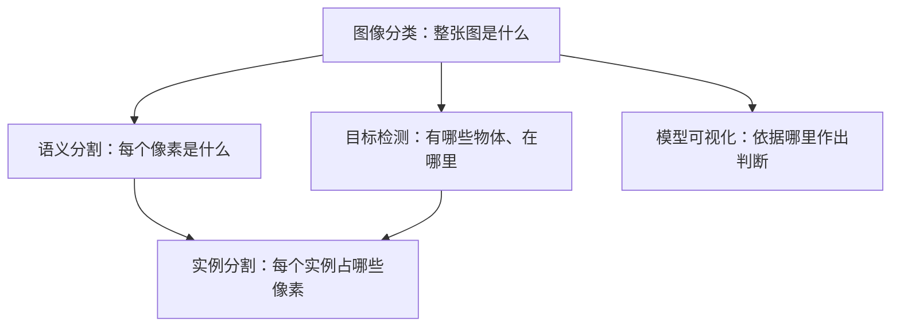

可以用三组矛盾记住本讲：

1. **语义与位置**：下采样帮助理解类别，上采样与跳跃连接恢复空间细节；
2. **精度与效率**：R-CNN 逐区域计算很慢，Fast/Faster R-CNN 共享特征并学习候选区域，单阶段检测器进一步直接密集预测；
3. **预测与解释**：模型不仅要给出结果，还可以通过 Saliency、CAM 和 Grad-CAM 检查它关注了什么。

## 8. 常见易错点

- 语义分割不区分同类实例；实例分割才区分。
- 转置卷积不是普通卷积的逆运算。
- Fast R-CNN 仍依赖外部候选区域；Faster R-CNN 才加入 RPN。
- Mask R-CNN 建立在 Faster R-CNN 上，并使用 RoI Align。
- Two-stage 与 One-stage 的区别不是是否使用 anchor，而是是否先产生候选区域再进行第二阶段处理。
- DETR 不是"没有框"，而是没有手工 anchor，直接输出框集合。
- 热力图说明模型关注或敏感的区域，不自动等同于因果证明。

## 9. 课件位置索引

- ViT 与 Transformer 回顾：第 4–28 页
- 视觉任务总览：第 29–33 页
- 语义分割、FCN、上采样与 U-Net：第 34–64 页
- 目标检测、R-CNN 系列、YOLO 与 DETR：第 65–111 页
- 实例分割与 Mask R-CNN：第 112–123 页
- 模型可视化、Saliency、CAM 与 Grad-CAM：第 124–145 页
