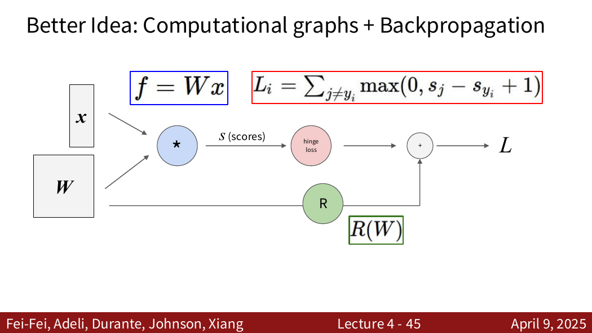
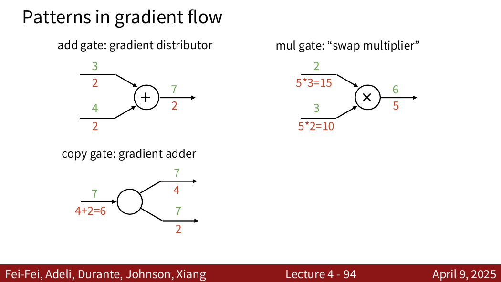

# 神经网络与反向传播

> 对应：CS231n 2026 Lecture 4、Section 2 Backprop

## 1. 从线性分类器到神经网络

两层全连接网络可以写成

$$
z_1=XW_1+b_1,
\qquad
h_1=\operatorname{ReLU}(z_1),
\qquad
s=h_1W_2+b_2.
$$

若没有非线性激活，多层线性变换仍可合并为一次线性变换，因此激活函数是网络表达非线性关系的关键。

神经网络并非天然适合“任意结构的数据”，它仍依赖合适的输入表示、网络结构、数据和训练方法。

## 2. 损失、目标函数和优化

- **样本损失**衡量单个预测与标签的差异；
- **数据损失**通常是样本损失的平均；
- **训练目标**通常还包含正则项。

$$
L(\theta)=\frac1N\sum_iL_i(\theta)+\lambda R(\theta).
$$

反向传播计算 $\nabla_\theta L$，优化器使用该梯度更新参数。反向传播本身不执行优化。

## 3. 计算图与链式法则

复杂函数可以拆成若干局部计算节点。每个节点在反向传播时执行同一模式：

$$
\text{下游梯度}=\text{上游梯度}\times\text{局部导数}.
$$

这里的“上游”指从最终损失传回当前节点的梯度；当前节点将计算后的梯度继续传向它的输入。

前向传播需要缓存反向传播所需的中间量，例如 ReLU 的输入、矩阵乘法的两个输入等。

## 4. 常见节点的反向传播

### 加法

若 (z=x+y)，则

$$
\frac{\partial L}{\partial x}=\frac{\partial L}{\partial z},
\qquad
\frac{\partial L}{\partial y}=\frac{\partial L}{\partial z}.
$$

### 乘法

若 (z=xy)，则

$$
\frac{\partial L}{\partial x}=\frac{\partial L}{\partial z}y,
\qquad
\frac{\partial L}{\partial y}=\frac{\partial L}{\partial z}x.
$$

### 分支与汇合

若同一变量通过多条路径影响损失，各路径的梯度必须相加：

$$
\frac{\partial L}{\partial x}
=\sum_r\left.\frac{\partial L}{\partial x}\right|_{r}.
$$

### ReLU

$$
\operatorname{ReLU}(x)=\max(0,x),
\qquad
\frac{\partial L}{\partial x}
=\frac{\partial L}{\partial y}\mathbf1[x>0].
$$

在 (x=0) 处数学上不可导，实际实现通常约定导数为 0。

## 5. 矩阵乘法的梯度

若

$$
Y=XW,
$$

且已知上游梯度 $G=\partial L/\partial Y$，则

$$
\frac{\partial L}{\partial X}=GW^T,
\qquad
\frac{\partial L}{\partial W}=X^TG.
$$

检查梯度公式时，结果形状必须与被求导变量相同。

对于 (Y=XW+b)，偏置在 batch 中共享，因此

$$
\frac{\partial L}{\partial b}=\sum_{i=1}^N G_i.
$$

## 6. Softmax 与交叉熵梯度

若 $p=\operatorname{softmax}(s)$，单样本损失为 $-\log p_y$，则

$$
\frac{\partial L}{\partial s_j}=p_j-\mathbf1[j=y].
$$

对 batch 平均损失还需除以 batch size。

## 7. 完整训练循环

最简单的 SGD 更新为

$$
\theta\leftarrow\theta-\eta\nabla_\theta L.
$$

梯度指向损失上升最快的方向，所以最小化时沿负梯度方向移动。

## 8. 梯度检查

可用中心差分检查解析梯度：

$$
\frac{\partial L}{\partial\theta_j}
\approx
\frac{L(\theta_j+h)-L(\theta_j-h)}{2h}.
$$

数值梯度很慢，只用于排查反向传播实现，不用于正式训练。

## 9. 易错点

- 反向传播计算梯度，SGD/Adam 更新参数。
- 多条路径的梯度相加，不是取平均。
- ReLU 是否传递梯度取决于前向输入，而不是上游梯度符号。
- 参数梯度形状必须与参数本身相同。
- Softmax 前减去最大分数不会改变概率，但能提高数值稳定性。

来源位置：Lecture 4 第 1–139 页；Section 2 Backprop 第 1–22 页。

## 10. PDF 知识点地图与补充图解

Lecture 4 的主线是：线性分类器 → 隐藏层与激活函数 → 计算图 → 标量节点的局部梯度 → 分支梯度相加 → 向量/矩阵反向传播 → 自动微分。

来源：Lecture 4，第 44 张 PDF 页面。计算图的价值不是改变函数，而是把复杂求导拆成可重复使用的局部规则。

来源：Lecture 4，第 93 张 PDF 页面（页脚标为 Lecture 4-94）。加法节点复制上游梯度；乘法节点用另一路前向值作为局部导数；变量分支后，各路径梯度在返回变量时相加。

来源：Lecture 4，第 130 张 PDF 页面。判断矩阵梯度公式时，应同时检查链式法则和形状：$dX$ 与 $X$ 同形，$dW$ 与 $W$ 同形。
