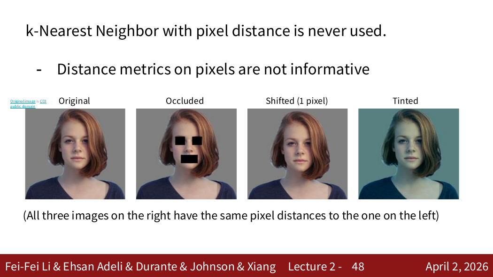
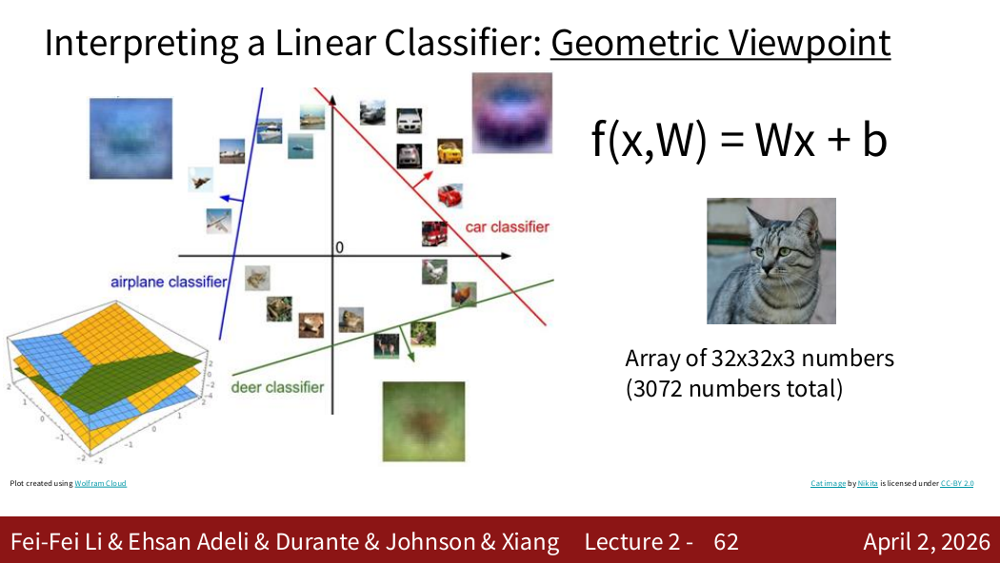
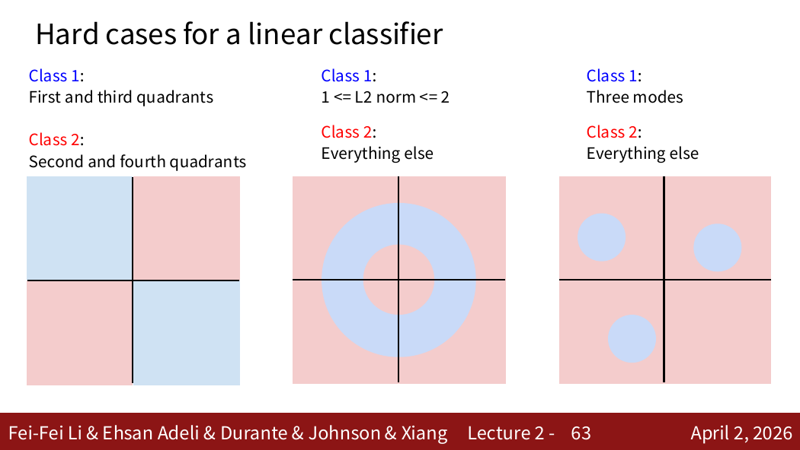

# 线性分类器与视觉分类

> 对应：CS231n 2026 Lecture 2，以及 Lecture 3 的损失与正则化部分

## 1. 图像分类

给定预先定义的类别集合，图像分类器接收一张图像并输出一个类别。计算机看到的是像素张量，而不是“猫”“汽车”等语义对象。

主要困难包括视角、尺度、形变、遮挡、光照、背景干扰和类内差异。

## 2. 数据驱动方法

```text
收集带标签数据 → 训练模型 → 用验证集选择超参数 → 最后在测试集评估
```

- 训练集用于学习参数；
- 验证集用于选择超参数和模型；
- 测试集只用于最终、尽量一次性的无偏评估。

## 3. k 近邻（k-NN）

k-NN 没有显式训练参数，而是保存训练样本。预测时：

1. 计算测试图像与所有训练图像的距离；
2. 找出距离最近的 (k) 个样本；
3. 通过投票预测类别。

常见距离：

$$
d_{L1}(x,z)=\sum_j\lvert x_j-z_j\rvert,
\qquad
d_{L2}(x,z)=\sqrt{\sum_j(x_j-z_j)^2}.
$$

L2 会平方各维差异，因此较大的单维差异影响更明显。不能简单断言某种距离总是更好，应使用验证集选择距离度量和 (k)。

k-NN 的特点是训练快、预测慢，而且直接比较原始像素对平移、裁剪和光照变化很敏感。

### 交叉验证

当数据较少时，可以把训练数据分成若干折，轮流使用一折验证、其余折训练，再平均验证结果。测试集不能参与超参数选择。

## 4. 线性分类器

将图像展平为 $x\in\mathbb R^D$，线性分类器计算

$$
s=Wx+b,
$$

其中 $W\in\mathbb R^{C\times D}$、$b\in\mathbb R^C$，输出 $C$ 个类别分数。

每一行权重可以看作某一类别的模板。线性分类器只能产生线性决策边界，因此不能表示所有复杂类别结构，但它是理解损失、优化和神经网络的基础。

## 5. 多类 SVM 损失

对样本 (i)，正确类别为 (y_i)：

$$
L_i=\sum_{j\ne y_i}\max(0,s_j-s_{y_i}+\Delta).
$$

它要求正确类别分数至少比错误类别高出间隔 (\Delta)。只有违反间隔的类别产生损失。

## 6. Softmax 与交叉熵

Softmax 将分数转换为概率：

$$
p_j=\frac{e^{s_j}}{\sum_k e^{s_k}}.
$$

交叉熵损失为

$$
L_i=-\log p_{y_i}.
$$

实现时先减去最大分数以提高数值稳定性：

$$
s\leftarrow s-\max_j s_j.
$$

SVM 关心是否满足间隔；Softmax 通过概率分布持续区分不同分数差距。

## 7. 正则化后的总目标

$$
L(W)=\frac1N\sum_iL_i(W)+\lambda R(W).
$$

常见 L2 正则化为

$$
R(W)=\frac12\lVert W\rVert_2^2.
$$

数据损失要求模型拟合训练集，正则项偏好更简单的参数解。优化过程利用梯度不断更新 (W,b)。

## 8. 易错点

- 参数由训练学习；(k)、距离度量、学习率和正则化强度属于超参数。
- 验证集用于调参，测试集不能反复查看。
- Softmax 输出和为 1，但高概率不自动代表模型真正可靠。
- 线性分类器的限制来自决策边界，而不是“不能处理图片”。

来源位置：Lecture 2 第 1–约 100 页；Lecture 3 第 1–约 20 页。

## 9. PDF 知识点地图与补充图解

Lecture 2 的完整主线是：分类困难 → 数据驱动 → k-NN → 数据划分与调参 → 参数化模型 → 线性分类器 → 损失函数。原笔记容易忽略的是“为什么像素距离和线性边界会失败”。



来源：Lecture 2，第 47 张 PDF 页面。三张在人看来语义相近的图像，在原始像素空间中可能相距很远，因此实际视觉系统通常不会直接对原始像素使用 k-NN。

### 线性分类器的两种解释



来源：Lecture 2，第 61 张 PDF 页面（页脚标为 Lecture 2-62）。

- **视觉解释**：$W$ 的每一行可以重塑为一张类别模板；
- **几何解释**：每个类别分数 $w_c^Tx+b_c$ 是输入空间中的超平面，预测取分数最大的类别。



来源：Lecture 2，第 62 张 PDF 页面。图中的环形类别、多个分离簇等都不能由单个线性边界正确划分，这正是后续引入隐藏层和非线性的原因。
